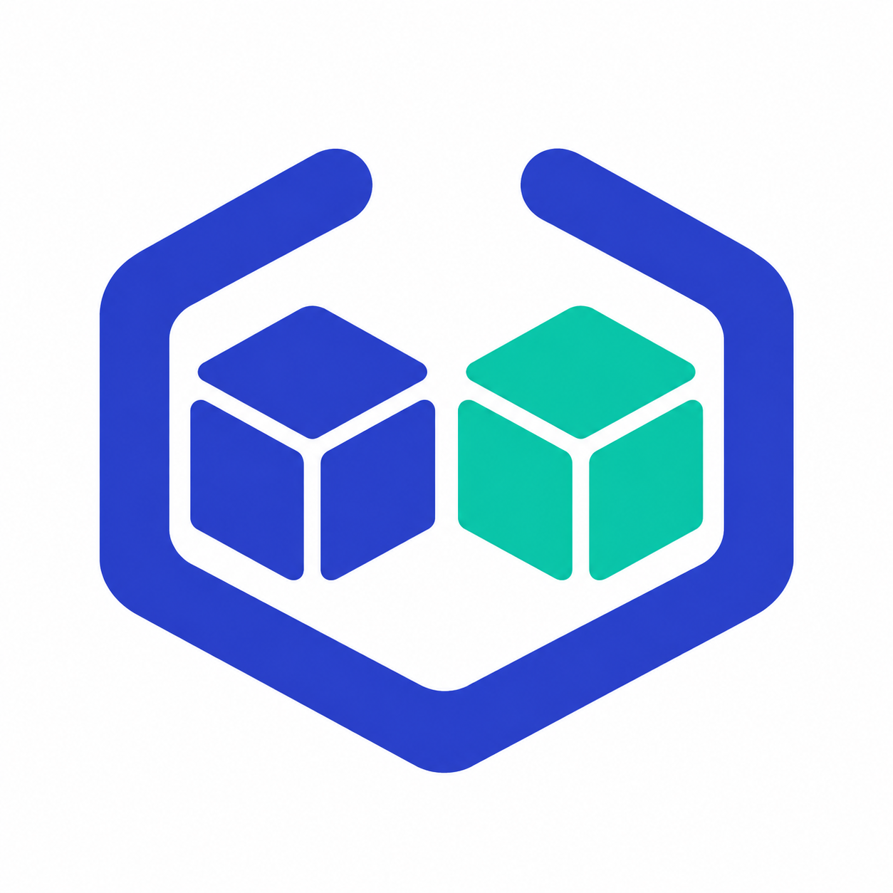

# Replicove



**Your cluster’s tools. A fresh place to test.**

[](https://github.com/nimeshbuilds/cluster-replica/actions/workflows/ci.yaml)
[](LICENSE)

Replicove is a Kubernetes operator and CLI that captures an administrator-granted selection of your cluster's configuration and reconstructs it in a [vCluster](https://www.vcluster.com/). Create disposable integration environments with familiar operators, inspectable plans, overrides, scoped credentials, and TTL cleanup.

**Experimental alpha, under active validation.** The portable implementation and tests are in this branch. The [validation record](docs/validation.md) distinguishes passed runtime checks from replication and workload checks still being qualified. Cloud labs are deferred. No container image or public release has been published yet.

[Quickstart](docs/replicove-quickstart.md) · [Implementation status](docs/IMPLEMENTATION_STATUS.md) · [Design](docs/design/vcluster-wrapper-design.md) · [Workload fixtures](docs/workload-adapters.md) · [Contribute](CONTRIBUTING.md)

## One request, a selected environment

After an administrator installs Replicove and creates `source-dev-lab`, apply:

```yaml
apiVersion: replica.nimeshbuilds.dev/v1alpha1
kind: ClusterReplica
metadata:
  name: integration
  namespace: replica-lab
spec:
  profile: vcluster-0.37.1-persistent
  grantRef: source-dev-lab
  ttl: 2h
  cleanupPolicy: DeleteOwned
  approval: Manual
  replication:
    namespaces: [source-dev]
    namespaceMap:
      source-dev: integration
    secrets: Snapshot
    helmReleases:
      - namespace: source-dev
        name: fixture
```

The operator reads the granted source, resolves dependencies and captures an encrypted plan. Approval creates a pinned vCluster and applies the selected desired state. Automatic approval is also available. You do not need to install the vCluster CLI or write a separate toolset blueprint.

```sh
replicove plan integration
replicove approve integration
replicove connect integration --role viewer --output integration.kubeconfig
```

The foreground connection opens a loopback tunnel, writes a new private kubeconfig, and removes it when the session ends. `replicove access` supports CI and in-cluster agents with an existing network route. The host's default kubeconfig is never modified.

## What the implementation covers

| Area | Behavior |
| --- | --- |
| Provisioning | Embedded operator installer; pinned vCluster OSS chart; durable or disposable control plane |
| Discovery | Kubernetes API and source Helm revision capture, bounded by administrator grants |
| Planning | Namespace/kind/name/label selectors, exclusions, reference dependencies, manual approval |
| Customization | Namespace and StorageClass maps, resource merge patches, Helm values overrides |
| Replication | CRDs, configuration, RBAC, supported operators and workloads; UID-based conflict protection |
| Secrets | Explicit name grants, encrypted snapshots, optional follow mode; source identity tokens excluded |
| Refresh | Explicit source recapture; preserve added experiment fields; report ordinary drift |
| Existing vClusters | Administrator-pinned credentials and cluster UID; preserve external runtime ownership |
| Access | Expiring guest viewer/deployer/admin identities for humans, CI and agents |
| Cleanup | Reverse object inventory, access revocation, finalizers, owned runtime and volume tracking |
| Maintenance | Versioned profiles, chart contracts, dependency updates, CLI/chart packaging |

See the [implementation ledger](docs/IMPLEMENTATION_STATUS.md) and actual PR checks for validation of each area. Tests exercise cert-manager, Kubernetes admission policy, Spark Operator and Trino; fixture availability alone does not establish support.

## Install from source

Prerequisites: Go 1.27.1+, Kubernetes access, and a registry for your operator build. Use a disposable cluster while the alpha is being qualified.

```sh
git clone https://github.com/nimeshbuilds/cluster-replica.git
cd cluster-replica
make build
docker build -t YOUR_REGISTRY/replicove:dev .
docker push YOUR_REGISTRY/replicove:dev
bin/replicove install --context YOUR_TEST_CONTEXT \
  --image YOUR_REGISTRY/replicove:dev --values operator-values.yaml
kubectl --context YOUR_TEST_CONTEXT apply -f administrator-grant.yaml
```

Complete [operator values](test/e2e/replicove-values.yaml), [grant](test/e2e/grant.yaml) and [selection](test/e2e/replication.yaml) examples are provided. The [quickstart](docs/replicove-quickstart.md) explains namespace delegation, credential distribution, refresh, existing targets and teardown.

## Replication boundaries

Replicove reproduces selected, supported desired state. It does not duplicate host workers, cloud control planes or arbitrary external services. Helm charts are reconstructed from stored chart content and revision values; the resulting resources join the ownership inventory and are **not guest Helm releases**.

Fresh PVCs require explicit `EmptyVolumes` permission and do not contain source data. Cloud identity annotations require a qualified adapter; copying an IRSA annotation alone does not establish identity. Platform provisioning, cloud identity exchanges, CSI snapshot/data restoration, External Secrets backend recreation and broader distribution qualification remain incomplete. Unsupported paths report a blocking condition.

Administrators control source grants and the separate encrypted-state namespace. Destination users share the capabilities of their namespace grant. Credential consumers need permission to get their exact returned Secret, not general Secret-read access to the runtime namespace. This is not yet a per-user multi-tenant gateway.

TTL includes planning and provisioning time. Cleanup respects object UIDs and finalizers and waits for supported owned volume cleanup. It does not forcibly delete unrelated resources or claim that deleting Kubernetes metadata erases external data.

## Develop and maintain

```sh
make generate          # API deepcopy and structural CRDs
make check             # race tests, chart contracts, real API server, vet, builds
make test-e2e          # original disposable kind/vCluster lifecycle
./hack/e2e-replication.sh  # full portable workflow, access, refresh, TTL
./hack/e2e-workload.sh spark  # also cert-manager, trino, policy
./hack/release-artifacts.sh v0.1.0-alpha.1
```

Live scripts require Docker and the pinned tools from `hack/fetch-e2e-tools.sh`. They create and remove their own kind clusters. They never use a production cluster. [Maintaining Replicove](docs/maintaining-replicove.md) explains how new vCluster releases are evaluated without silently upgrading existing replicas.

Built in public by [Nimesh Builds](https://github.com/nimeshbuilds). The [name research and icon](docs/brand/research.md) document Replicove's identity. Reproducible cluster-testing problems, operator fixtures and failure reports are welcome.

Replicove is independent of the vCluster maintainers. The repository is Apache-2.0 licensed; upstream artifacts retain their own licenses.
