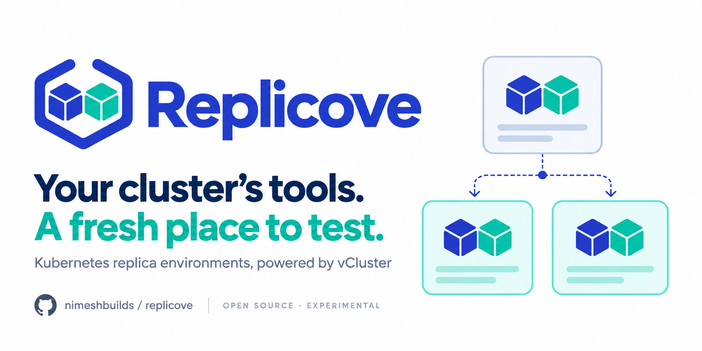

# Replicove

<p align="center">
  
</p>

[](https://github.com/nimeshbuilds/replicove/actions/workflows/ci.yaml?query=branch%3Amain)
[](LICENSE)
[](docs/project-status.md)
[](https://github.com/nimeshbuilds/replicove/discussions)

**Replicove is an open-source Kubernetes operator for building disposable integration-test environments with [vCluster](https://www.vcluster.com/).** Its goal is to recreate the selected operators, configuration, and dependencies your application needs inside a virtual cluster, using a declarative `ClusterReplica` request.

[Get started](docs/runtime-quickstart.md) · [Documentation](docs/README.md) · [Project status](docs/project-status.md) · [Roadmap](ROADMAP.md) · [Contribute](CONTRIBUTING.md)

> **Experimental, under active development.** `main` contains the runtime prototype: provision a vCluster, observe readiness, and remove its Helm release on deletion or TTL expiry. The broader replica workflow has passed disposable-cluster CI in [PR #8](https://github.com/nimeshbuilds/replicove/pull/8) and is still under development there. No packaged public release or production support is available yet.

## Why Replicove?

An empty test cluster does not reproduce an application’s environment. Operators, admission rules, configuration, and credentials all influence whether an integration test tells you something useful.

Replicove builds toward a repeatable workflow: select what matters from an authorized source, inspect a plan, create a virtual environment, run your test, then expire the environment. vCluster supplies the virtual Kubernetes control plane; Replicove adds the selection, replication, access, and lifecycle workflow around it.

Useful scenarios include testing operator upgrades, reproducing configuration bugs, creating preview environments, and giving CI or coding agents a temporary Kubernetes workspace.

## What can I use today?

| Available on `main` | Portable alpha in [PR #8](https://github.com/nimeshbuilds/replicove/pull/8) |
| --- | --- |
| Namespaced `ClusterReplica` CRD | Administrator-controlled source and destination grants |
| Pinned vCluster installation through the Helm SDK | Selected Helm components, resources, and secrets |
| Readiness and ownership checks | Inspectable plans, approval, overrides, and refresh |
| Deletion and TTL of the owned Helm release | Scoped guest access for people, CI, and agents |
| Source build and lab setup | Owned-resource cleanup and persistent control-plane tests |

The alpha’s [eight-job CI run](https://github.com/nimeshbuilds/replicove/actions/runs/35467194302) passed on commit `5ffeb42`, including host Kubernetes 1.35.8 and 1.36.4, vCluster 0.37.1, and small cert-manager, Spark, Trino, and admission-policy scenarios. These are **functional test results**, not production-scale or cloud-platform certification. See [project status and evidence](docs/project-status.md).

## Try the runtime prototype

Use a disposable cluster or namespace administered by someone you trust. You need Go 1.27.1+, `kubectl`, and a Kubernetes cluster.

```sh
git clone https://github.com/nimeshbuilds/replicove.git
cd replicove
make build

kubectl apply -f config/crd/replica.nimeshbuilds.dev_clusterreplicas.yaml
kubectl apply -f config/rbac/lab.yaml
./bin/cluster-replica --watch-namespace replica-lab
```

In another terminal, create your first request:

```yaml
apiVersion: replica.nimeshbuilds.dev/v1alpha1
kind: ClusterReplica
metadata:
  name: integration
  namespace: replica-lab
spec:
  profile: vcluster-0.37.1-lab
  ttl: 2h
  cleanupPolicy: HelmReleaseOnly
```

```sh
kubectl apply -f config/samples/replica.yaml
kubectl get clusterreplicas -n replica-lab -w
```

The operator installs vCluster itself; a preinstalled vCluster binary is unnecessary for provisioning. Follow the [runtime quickstart](docs/runtime-quickstart.md) to connect, delete, and understand permissions and cleanup. Contributors trying the replica workflow should use the [alpha quickstart at the tested revision](https://github.com/nimeshbuilds/replicove/blob/5ffeb4243f7e6588fb5a04afe906f1cc40c47624/docs/replicove-quickstart.md).

The public name is Replicove. The Go module, prototype binary `cluster-replica`, and API group retain their original identifiers during the alpha so existing development workflows remain usable.

## Boundaries that matter

- Replication is **selected and authorized**. A virtual cluster cannot reproduce every host, cloud, storage, or operator behavior automatically.
- `main` uses an `emptyDir` lab control plane. Rescheduling can lose its state. `HelmReleaseOnly` does not promise deletion of guest workloads, PVCs, snapshots, or external resources.
- IRSA and other cloud identity adapters, data restoration, vCluster Platform integration, and distribution-specific qualification remain future work.
- Compatibility depends on Kubernetes versions, APIs, and capabilities. EKS, AKS, GKE, OpenShift, and RKE2 are not currently certified.

Read [Security](SECURITY.md), [compatibility policy](docs/design/vcluster-compatibility-policy.md), and [the implementation plan](docs/design/cluster-replica-implementation-plan.md) before extending the project.

## Build with us

Built in public by [Nimesh Builds](https://github.com/nimeshbuilds). Share a reproducible cluster-testing problem in [Discussions](https://github.com/nimeshbuilds/replicove/discussions), [report a bug](https://github.com/nimeshbuilds/replicove/issues/new/choose), or improve a guide you tried. The [contribution guide](CONTRIBUTING.md) explains local checks and how to propose an adapter. If this solves a problem you care about, a star helps others discover it.

Replicove is an independent project, unaffiliated with the vCluster maintainers. Licensed under [Apache-2.0](LICENSE); upstream components retain their own licenses. [Brand assets and usage](docs/brand/README.md).
