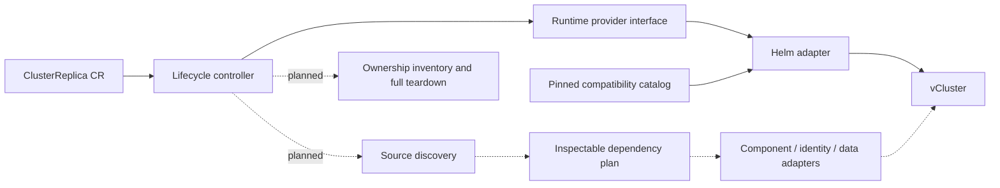

# Architecture

ClusterReplica adds discovery, planning, component replication, access policy, and lifecycle management around vCluster. The first prototype implements only the standalone runtime and a limited lifecycle.

## Implemented boundaries

- `api/v1alpha1`: a namespaced, deliberately small immutable request. Detailed product fields in the design documents are proposals, not silently ignored API features.
- `internal/controller`: persist a finalizer and resolved runtime before installation; reconcile readiness, deletion, and a creation-time TTL. Never pass raw runtime errors into status.
- `internal/runtime`: idempotent provider contract. It knows nothing about source discovery or any cloud distribution.
- `internal/runtime/helm`: installation and observation, release ownership verification, chart-manifest cleanup with retained history until absence is verified. It uses the same authenticated Kubernetes REST configuration as the manager.
- `internal/catalog`: exact chart URL/hash, guest version, and values translation. No `latest` selection, user-controlled download URL, or arbitrary Helm values.

The operator watches one explicitly granted namespace and uses leader election there. The host namespace exists independently and is never owned/deleted by a request. Runtime Secrets are accessed directly through the Helm client, not through a cluster-wide Secret informer.

## State and recovery

`Provisioning → RuntimeReady → Deleting → Expired` describes the ordinary lifecycle; `Rejected` and `Blocked` expose invalid intent or runtime failure. Kubernetes deletion uses a finalizer and removes the CR after cleanup rather than recording `Expired`.

The Helm release name is derived from the CR UID. The resolved profile and expiry are persisted before the first external mutation. Reconciliation after a process restart keeps that identity. Failed and pending Helm installations are inspected without starting an overlapping installation or automatically taking ownership; deletion/expiry remains available.

The current cleanup contract covers chart manifest objects. It preserves Helm release history until they are absent, checks object ownership before uninstall, and blocks on retention policies or ownership conflicts. It deliberately does not equate release deletion with deletion of all guest data or generated credentials.

## Next architectural addition

Introduce a read-only capture and planner before adding host-to-guest mutations. A plan should identify source provenance, required APIs, installation order, overrides, conflicts, unsupported components, and expected ownership. Runtime providers stay independent: Helm standalone, existing guest, and vCluster Platform use different lifecycle ownership contracts.

See the [full product design](design/vcluster-wrapper-design.md), [implementation plan](design/cluster-replica-implementation-plan.md), and [compatibility policy](design/vcluster-compatibility-policy.md).
