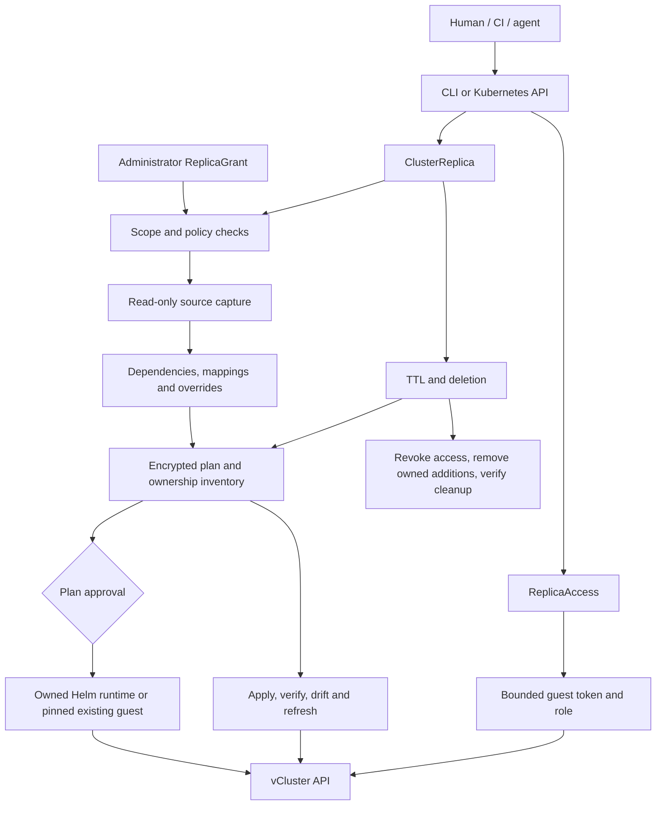

# Replicove architecture

Replicove is one Go operator plus a CLI. The core workflow depends on Kubernetes APIs and a pinned vCluster runtime; cloud identity, storage and distribution capabilities require separately qualified adapters.

## Code boundaries

| Package | Responsibility |
| --- | --- |
| `api/v1alpha1` | Six CRDs: ClusterReplica, ReplicaGrant, ReplicaAccess, ReplicaMirror, ReplicaMirrorRun, ReplicaExperiment |
| `internal/controller` | Namespaced dispatch and retained legacy HelmReleaseOnly lifecycle |
| `internal/policy` | Source, destination, credential, existing-target, TTL and size grants |
| `internal/capture` | Bounded API reads and exact Helm revision reconstruction; no source writes |
| `internal/planner` | Selectors, safe transformations, known references and deterministic order |
| `internal/state` | Compressed AES-GCM captures, keyed plan revisions, durable intent and UID inventory |
| `internal/catalog` | Exact upstream pins and version-specific values profiles |
| `internal/runtime/helm` | Install, observe and remove a runtime while preserving Helm ownership/history |
| `internal/target` | Data-only kubeconfigs, TLS validation and guest/host identity checks |
| `internal/workflow` | Approval, apply, readiness, drift, refresh, secret follow, access and cleanup |
| `internal/capacity` | Encrypted optimistic-concurrency reservations, grant caps and destination runtime admission |
| `internal/database` | Read-only source dump, isolated staging masks/subsets, validated second restore and owned cleanup |
| `internal/chaos` | Exact owned fault targets, grant/resource limits, durable rollback and host isolation |
| `internal/testrun` | Local recipe orchestration, bounded execution/access/leases, metadata reports and verified cleanup |
| `internal/diagnostics`, `agentapi`, `dashboard` | Metadata evidence, caller-identity stdio MCP and loopback read-only UI |
| `cmd/replicove` | Embedded installation, request lifecycle, scoped credentials and local tunnel |
| `charts/replicove` / `config/install` | Shared chart and generated native YAML, immutable key/bootstrap Job and explicit source/destination RBAC |

The operator watches one destination namespace. The state namespace is separate from both destination and sources. Cross-namespace reads use an uncached client; there is no global Secret informer. The installer labels its own infrastructure so it cannot become a guest source dependency.

## Authorization and ownership

Kubernetes RBAC authenticates callers. Cluster administrators create grants; users who can create requests in a destination namespace share that namespace's granted options. The controller never reconstructs caller identity from user-editable annotations. Per-user gateway authorization remains a future interface.

A grant's UID and resourceVersion are pinned in encrypted state. A grant change blocks new changes and access issuance; cleanup continues using protected ownership records. Existing targets additionally require a kubeconfig in the protected namespace and a pinned `kube-system` UID. The host cannot be selected as its own guest.

An operation intent is persisted before a guest create. Completed operations record UIDs and random operation markers. Apply and cleanup reject reused names, foreign objects and changed ownership. An existing guest's runtime and preexisting namespaces are never adopted.

## Capture and reconciliation

Capture is a sequence of bounded source reads, not an atomic cluster database snapshot. Helm charts are reconstructed from stored content and revision values. Rendered resources enter the same graph and ownership inventory as raw desired-state objects; they are not installed as guest Helm releases.

Dependencies include known Kubernetes references, chart CRDs, captured controller readiness, and RBAC needed by controller workloads. Unknown application-specific references are not guessed. Lifecycle hooks, unadapted host/cloud capabilities and missing dependencies block a plan.

A manual approval binds to the keyed plan revision. A durable capacity reservation precedes managed installation; grant limits and the one-runtime destination constraint queue excess requests without changing TTL. Runtime identity is persisted before installation. The persistent profile uses a StatefulSet and a fresh control-plane PVC; the lab profile uses a Deployment and emptyDir. Ordinary reconciliation verifies readiness and reports drift. Explicit refresh recaptures source state, applies changes to source-owned fields, and preserves unrelated added fields.

## Access and cleanup

ReplicaAccess creates a guest service account and a viewer, deployer or admin binding within the grant. Kubernetes TokenRequest issues a bounded token. The resulting private kubeconfig lives in an immutable host Secret; status contains only its reference and expiration. Optional administrator-configured `accessSubjects` receive per-session, exact-name Secret-get Roles and bindings, recorded in encrypted ownership state. Revocation removes these permissions before guest identities and credentials. Without configured subjects, administrators supply exact-name RBAC themselves. The CLI tunnel uses the caller's host authentication and retains the guest's verified TLS name.

Cleanup persists its intent, revokes access, removes guest objects in reverse order, then removes the owned runtime. Host cleanup follows recorded ownerReference UIDs and tracks bound PersistentVolume identities. It requires supported Delete reclaim behavior and waits for deletion; it does not directly delete arbitrary PVs. State is removed last, after terminal status is persisted. Finalizers remain when verification cannot complete.

## Remaining provider boundaries

Configured vCluster Platform requests currently block with `PlatformQualificationRequired` and cannot silently fall back to Helm. Cloud identity exchange, general database/PITR recovery, external backend recreation and broader vendor qualification are not implemented or certified by the portable fixtures. The scoped PostgreSQL 17 adapter is a separate optional path, described below. The optional CSI mirror controller adds independent storage copies with its own qualification suite; it does not turn the generic workflow into an exact clone. See the [implementation ledger](IMPLEMENTATION_STATUS.md), [full plan](design/cluster-replica-implementation-plan.md) and [maintenance guide](maintaining-replicove.md).

## Optional workload mirror controller

`ReplicaMirror` owns the overall TTL and active generation. Immutable `ReplicaMirrorRun` requests queue Sync or Reset operations. The controller captures a protected desired-state plan and explicitly granted CSI snapshots, imports read-only recovery points into the destination namespace, and prepares a separate `ClusterReplica` generation with independent writable PVCs. A host NetworkPolicy is established before application objects are applied. Access is issued only for the active generation.

The private state journal binds each creation operation, source/target UID, capture handle, and active/pending pointer. Activation checks restored storage and the candidate again after a test lease. Cleanup inventories partially restored volumes, waits for guest/host deletion, preserves referenced capture revisions, and never writes changes back to the host workload. A reset uses a saved capture; a sync takes a new capture. Existing runtimes use exclusive generation namespaces and namespaced guest RoleBindings.

The pinned vCluster allows one control plane per host namespace. Managed replacements prepare captures, honor the lease, clear the protected active pointer and finish old-runtime cleanup before provisioning the next control plane. This entails downtime and does not roll back a failed replacement automatically. Existing-target replacements can prepare independent namespaces concurrently inside their already running control plane. Neither path acquires permission to create arbitrary host namespaces.

The Helm module conditionally installs the pinned upstream snapshot controller and APIs if absent, or uses the host's installation. CSI drivers and enforced CNI are host capabilities; Replicove does not replace them. Details, failure recovery and YAML/CLI examples are in [workload mirrors](guides/mirrors.md).

## Optional PostgreSQL preparation

Database grants bind a protected source credential, exact database selection, target image/storage limits, approved masks/table filters and relationships. They do not derive authority from PVC or Secret selection. Before any application object is applied, the database hook creates host deny policies, verifies translated Pod labels and conflicting policy absence, and restores a consistent PostgreSQL 17 logical dump into memory-backed staging with TCP rejected.

Filtering and masking run only in staging. Native foreign keys and declared relationships must pass before a second logical dump is restored into fresh final storage. Staging guest and physical host Pods must disappear before final TCP publication and application/access startup. Durable Copying state fails closed after an interrupted copy; recreation is required instead of silently recapturing source data. Cleanup uses recorded identities and keeps host policy protection until the translated Pods are gone. This path accepts only new managed targets, without mirrors or in-place refresh.

## Faults and local automation

`ReplicaExperiment` records bounded fault intent and rollback against exact owned workload identities. Replica cleanup and mirror replacement settle experiments first. Network/Job faults require managed-runtime host policies and reject overlapping allow policies; rollback waits for physical Job Pods to stop before removing isolation. Shared workers remain a host trust boundary.

The CLI test runner orchestrates fresh requests, bounded guest access, optional mirror leases/faults, local command execution and verified cleanup. It records safe plan identities and outcomes, not a replayable capture. Pool selection uses readable occupancy as a hint; only the operator's protected ledger reserves capacity. The stdio MCP server and loopback dashboard reuse the caller's host Kubernetes identity and metadata views; neither reads the protected capture store or supplies a separate identity service.
