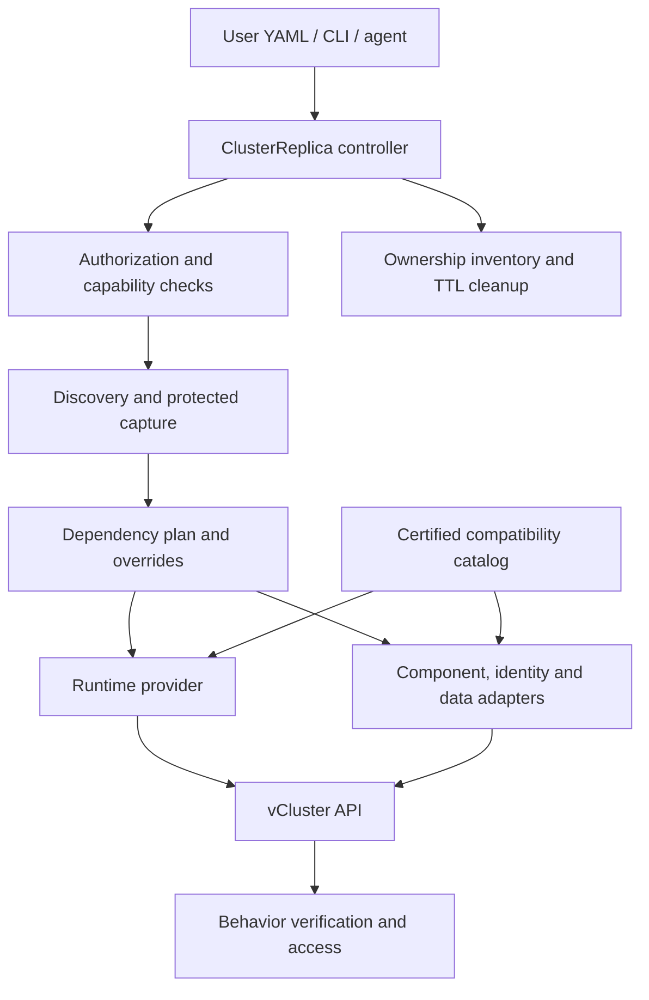

> **Design scope:** This document describes the complete intended product. The [current prototype](../../README.md) implements only a small runtime/lifecycle subset. Examples in this directory are proposals, not installable manifests.

# ClusterReplica implementation plan

Status: full product roadmap, 19 September 2026. A minimal runtime prototype now exists; see the [current README](../../README.md) for implemented behavior. The detailed APIs and acceptance gates below remain proposed until explicitly completed. This plan turns the [product architecture](vcluster-wrapper-design.md) into phased engineering work. The accompanying [vCluster compatibility policy](vcluster-compatibility-policy.md) defines release certification and maintenance.

## 1. Outcome and scope

An administrator installs one operator and configures discovery, execution, access, and cloud permissions once. A developer then applies one namespaced `ClusterReplica` resource. The operator creates a vCluster or integrates with an authorized existing setup, discovers the main cluster's selected software environment, reproduces supported configuration and dependencies, provides access, and tears down owned resources after a TTL.

The developer does not first assemble a Helmfile, platform template, or blueprint. The system generates an inspectable installation plan internally. Include/exclude selectors and overrides remain part of the same request. Failed prerequisites produce actionable status, never a misleading Ready result.

The core product targets compatible Kubernetes APIs and versions. EKS is a real-cloud validation environment and supplies the first cloud identity adapter; it is not a dependency of generic provisioning, discovery or replication. Distribution names provide diagnostic context and adapter hints. Actual versions, available APIs, permissions and required capabilities determine whether a request can succeed.

The completed product covers:

| Requirement | Implementation location | Completion evidence |
| --- | --- | --- |
| Install vCluster automatically when absent | Runtime providers, Phase 2 | A fresh host accepts one CR and produces a usable virtual API. |
| Integrate existing Platform or standalone installations | Runtime providers, Phase 2 | Platform policies are respected; unrelated releases remain untouched. |
| Populate an explicitly selected existing vCluster | Existing-target provider, Phase 2 | Object conflicts are reported and its external lifecycle ownership is preserved. |
| Discover and reproduce host tools/configuration | Capture, planner, adapters, Phases 3–4 | An independently configured host is reproduced without a user-authored blueprint. |
| Select and customize the replica | API and planner, Phases 1, 3–4 | Inclusion, exclusion, dependency conflicts, and overrides have deterministic outcomes. |
| Copy secrets and recreate workload identity | Secrets and identity, Phases 4–5, 8 | Selected values arrive correctly; target identities authenticate to designated dependencies. |
| Run Spark and Trino workloads | Workload adapters, Phase 5 | A real Spark job and Trino query complete inside the replica. |
| Ephemeral clusters with owned-data cleanup | Lifecycle and data adapters, Phases 2, 6 | TTL cleanup leaves no unexplained owned resources in supported scenarios. |
| Human, CI, and agent access | Access provider, Phases 2, 7 | Laptop, CI runner, and an in-replica agent use independently scoped identities. |
| Kubernetes version/API compatibility | Compatibility resolver and discovery, Phases 0–4 | Certified host/guest version pairs pass; unsupported APIs or required features fail with a precise explanation. |
| EKS, AKS, GKE, OpenShift, RKE2 integrations | Capability adapters and representative environment tests, Phase 8 | Identity/storage/admission behavior passes on named environments without a separate replication engine per distribution. |
| Manage new vCluster releases economically | Compatibility layer and CI, all phases; completion in Phase 9 | A candidate release is evaluated without changing discovery or workload adapters. |

Replication means the selected application's supported configuration and behavior. Shared worker infrastructure remains supplied by the host. Host support for OpenShift does not make the guest a full OpenShift control plane. External data can be reused or independently provisioned/restored; that choice determines what TTL can delete.

## 2. Architecture chosen for implementation

Start with one Go operator and one CLI. Use controller-runtime/client-go for Kubernetes work and a Helm provider for runtime/package lifecycle. Select exact dependency versions together during Phase 0. Keep an optional access gateway and optional MCP server as thin clients of the same authorization and lifecycle services. A separate microservice for every subsystem would add avoidable operational work.



### Module boundaries

| Module | Responsibility | Dependency rule |
| --- | --- | --- |
| API/controller | Spec validation, reconciliation, conditions, expiry | Orchestrates interfaces; contains no vCluster chart field names. |
| Discovery | API inventory, Helm release provenance, source references | Reads the source; never installs target resources. |
| Capability resolver | Host/guest versions, served APIs, permission and feature evidence | Uses capabilities to select adapters; distribution branding alone neither enables nor disables the core path. |
| Planner | Selection, dependency graph, transformations, plan revision | Deterministic from captured inputs and policy. |
| Runtime provider | Create/connect/observe/update/delete runtime | Contains Helm/Platform differences behind one contract. |
| vCluster compatibility | Translate our runtime intent into version-specific values; identify supported capabilities | The only module aware of vCluster configuration differences. |
| Component adapters | Capture/install/verify a particular tool or operator | Talk to guest Kubernetes and package APIs, not vCluster internals. |
| Identity adapters | IRSA, EKS Pod Identity, AKS and GKE bindings | Separate cloud credentials and ownership from guest credentials. |
| Data adapters | Provision/seed/restore/verify/delete owned data destinations | State explicit consistency and deletion capabilities. |
| Access provider | Authentication, role mapping, sessions, endpoints | Same rules for CLI, CI, and agents. |
| Artifact store and inventory | Protected capture content, exact versions, durable operation/resource handles | Remain available through retries and teardown. |

Provider contract: `Validate`, `Ensure`, `Observe`, `ConnectionInfo`, `PlanUpgrade`, `Upgrade`, and `DeleteOwned`. The existing-target implementation rejects runtime lifecycle mutations it does not own. A persistent provider handle records the selected manager and resource identity.

Component adapter contract: `Detect`, `Capture`, `Dependencies`, `Transform`, `Install`, `Verify`, and `Cleanup`. Each adapter declares supported versions, required permissions, sensitivity rules, and whether it supports refresh. Begin with built-in Go adapters plus declarative configuration packs. Avoid dynamic Go plugins and arbitrary downloaded scripts. Add an external adapter protocol only when a concrete integration needs independent executable code.

### Kubernetes compatibility comes first

The primary compatibility record is `(wrapper release, vCluster release, host Kubernetes minor, guest Kubernetes minor)`, with exact builds and digests recorded as evidence. Attach required capability and component profiles to that record. Begin with two adjacent Kubernetes minors supported by the selected runtime and upstream Kubernetes; certify matching host/guest minors first. An unrecognized vendor name does not by itself reject a request that meets a certified generic profile. Such a result also does not establish vendor-specific certification.

Generate an internal `ClusterCapabilities` report automatically. It contains raw and normalized Kubernetes versions, available API groups/versions and schemas, observed node versions/architecture where authorized, admission constraints, storage/snapshot classes and drivers, network/routing requirements, workload identity mechanisms and installed operator versions. Each finding has evidence and a supported/unsupported/unknown state. A permission-denied read is Unknown. API discovery cannot reveal all server flags or feature gates, and a CRD's presence alone does not prove that its controller or backend works.

Use discovery/OpenAPI for available API shapes, administrator configuration for inaccessible settings, and bounded validation or workload probes for behavior. Server-side dry runs can validate manifests after their target CRDs and admission services exist; they do not prove scheduling, data access or successful cloud provisioning. [Kubernetes API discovery and schemas](https://kubernetes.io/docs/concepts/overview/kubernetes-api/)

For the normal replica mode, resolve `match-host` to the source host minor at creation and pin a certified guest patch. Preserve the raw vendor build string in diagnostics, but do not treat that string as a guest image tag or promise the same vendor patches/control-plane settings. Check selected charts, CRDs, conversion webhooks and operators against the target API as a separate step. Matching Kubernetes minors does not imply matching operator APIs.

An explicitly requested different guest minor is a later compatibility-testing mode, enabled only for certified host/guest/runtime combinations. It can exercise guest API/operator compatibility, but shared nodes still use the host's kubelets, CNI, CSI and infrastructure. It is not a complete rehearsal of upgrading the host cluster. vCluster's matrix distinguishes tested matching versions from other combinations described as likely compatible; do not promote the latter by inference. [vCluster Kubernetes compatibility matrix](https://www.vcluster.com/docs/vcluster/manage/upgrade/supported_versions#kubernetes-compatibility-matrix)

Select adapters by requirements: an IRSA-using workload needs the AWS adapter, a selected snapshot restore needs a supported snapshot/storage adapter, and OpenShift admission restrictions need the corresponding configuration support. Optional adapters stay unused when the request does not need them. A missing required adapter blocks the affected request; it must not silently remove the source capability. Keep version compatibility, capability satisfaction, toolset compatibility and behavior verification as separate reported conditions.

### Proposed repository layout

```text
api/v1alpha1/                 ClusterReplica and administrator policy types
cmd/operator/                controller entry point
cmd/replica/                 CLI and credential helper
internal/controller/         reconciliation and lifecycle state
internal/discovery/          source inventory and provenance
internal/capabilities/       version/API detection and capability resolution
internal/planner/            capture selection, graph and transformations
internal/runtime/helm/       standalone vCluster provisioning
internal/runtime/platform/   VirtualClusterInstance integration
internal/runtime/existing/   externally owned target connection
internal/compat/vcluster/    small version translation layer
internal/adapters/           Helm, cert-manager, Spark, Trino, policy tools
internal/identity/           AWS, Azure, GCP integrations
internal/data/               PVC, object storage, database adapters
internal/access/             grants, sessions and connection routing
internal/inventory/          owned resources and durable operations
internal/artifacts/          protected captures and package cache
compatibility/               exact certified version/profile records
charts/cluster-replica/      operator installation chart and CRDs
config/                      RBAC and local deployment manifests
test/fixtures/               non-secret source/configuration fixtures
test/contract/               provider and adapter contracts
test/e2e/                    real Kubernetes and cloud scenarios
docs/                        tutorials, API, compatibility and runbooks
```

## 3. API and reconciliation contract

Keep `ClusterReplica` as the single resource developers need. An administrator-managed `ReplicaPolicy` may define allowed sources, destinations, cloud roles, access profiles, resource ceilings, and maximum TTL. Users may reference an allowed policy but cannot enlarge their grant by editing a request. Internal capture records are generated automatically and are not a second user workflow.

The [example resource](cluster-replica.example.yaml) supplies the starting API. Finalize these additional semantics in Phase 1:

- `metadata.namespace` identifies the destination host namespace; a cross-namespace target needs a separately authorized integration.
- `source.cluster: host` discovers the current host. Remote source clusters are an extension after local discovery works.
- `vcluster.provider: auto` selects the configured authorized Platform integration or standalone Helm. A Platform error is not permission to bypass it with Helm. `existingRef` is explicit.
- `vcluster.versionPolicy: certified` selects an exact runtime from the bundled certified catalog. `kubernetesVersionPolicy: match-host` requests the host Kubernetes minor where a tested combination exists. Record the exact resolution; a missing compatible combination blocks creation and lists supported choices.
- Runtime version, guest Kubernetes version, provider, adapter pack, artifact digest, and captured source revision are locked for the replica. A wrapper update does not silently change them.
- A host upgrade triggers compatibility reassessment. `match-host` does not continuously upgrade the guest; report a changed or unsupported pair, stop incompatible new mutations, and retain observation and cleanup paths.
- `replication.include` selects components, namespaces, kinds, or labels; `exclude` wins. Required excluded dependencies generate a conflict with the dependency path.
- `replication.secrets` controls copying and snapshot/follow behavior. Source-to-destination grants are enforced for contents as well as metadata.
- `overrides` supports Helm values, typed object patches, and explicit mappings for namespaces, domains, storage, credentials, and cloud roles.
- `data.mode` distinguishes source sharing from isolated owned destinations. Isolated mode is supported only where every selected writable dependency has a verified mapping.
- `lifecycle.sourceUpdates: manual` captures once and refreshes only on request. `targetDrift: report` lets developers experiment without continuous resets.
- TTL is measured from CR creation, including provisioning time. Its persisted deadline survives restarts. Expiry starts cleanup, while completion is tracked separately.

State progression: `Pending → Discovering → Planning → Provisioning → Installing → Verifying → Ready`. A recoverable error retains its phase, reason and retry information. Expiry/deletion branches from every phase into `Expiring → Deleting → CleanupComplete`, with `CleanupBlocked` when work remains. Use conditions and observed generation; do not rely on one status string alone.

Persist each external operation's intent before execution and store its returned handle afterward. Recover ambiguous create results through a deterministic operation ID or owned-resource lookup. Use leader election, optimistic concurrency, per-replica serialization, bounded concurrency, rate limits, deadlines and exponential backoff. Duplicate reconciliation must not create duplicate cloud resources, vClusters or Helm releases.

Keep only bounded metadata in CR status. Large captures live in a protected artifact store. Encrypt sensitive payloads and exclude them from logs, generic exports and public digests. Use authoritative object/cloud IDs and provenance for cleanup; a tenant-editable label alone does not establish deletion ownership.

## 4. Phase roadmap

Effort estimates are planning ranges in engineer-weeks, including implementation and the stated verification. They are not calendar promises or measured productivity. Some phases can overlap once their dependencies are ready. Every phase begins as **not started**.

| Phase | Deliverable | Dependencies | Effort |
| --- | --- | --- | --- |
| 0 | Feasibility and compatibility baseline | None | 1–2 |
| 1 | API, controller and project foundation | 0 | 2–3 |
| 2 | Easy vCluster provisioning, connection and basic TTL | 1 | 3–5 |
| 3 | Automatic host discovery and planning | 1–2 | 3–5 |
| 4 | Recreate toolsets, configuration and secrets | 3 | 4–7 |
| 5 | Portable Spark/Trino environments and AWS identity adapter | 2, 4 | 4–6 |
| 6 | Isolated data and verified teardown | 4–5 | 4–7 |
| 7 | Full human, CI and agent access | 2; identity/data profiles as needed | 3–5 |
| 8 | Additional capability adapters and environment qualification | 4–6 | 6–10 |
| 9 | Complete upgrade certification and recovery | Starts in 1; final gate after 2–8 | 3–5 |
| 10 | Beta, usability, scale and general availability | 6–9 for the claimed feature set | 2–4 |

The total is **35–59 engineer-weeks** before substantial scope expansion. Version testing starts in Phase 1; Phase 9 completes the release process rather than adding compatibility as an afterthought.

### Phase 0 — Prove the integration boundary

**Purpose:** resolve the few uncertainties that could otherwise invalidate the implementation plan.

- **P0.1:** Choose exact Go/controller-runtime/client-go/Helm dependencies; resolve their Kubernetes library compatibility in one build.
- **P0.2:** Select an exact vCluster OSS chart/image and two adjacent Kubernetes minors for initial matching host/guest tests, within the overlap of runtime and Kubernetes support. Treat the currently documented 0.37 and 0.36 runtime lines as certification candidates, not pre-certified support. Do not select an unsupported newest Kubernetes minor merely to match its release date.
- **P0.3:** Run the standalone create/connect/delete path on a disposable host. Record the chart archive digest, image digest, schema, rendered RBAC and actual runtime version.
- **P0.4:** Prove guest operator CRDs, webhook readiness, Secret delivery, PVC provisioning and service-account mapping with the pinned OSS build.
- **P0.5:** Prove the IRSA token path and verify which pieces require optional Platform capabilities. Public docs alone are insufficient evidence of OSS entitlement. If a required path is unavailable, either implement a bounded adapter through supported OSS/Kubernetes interfaces or explicitly gate that combination; never silently switch to a licensed image or change the promised behavior.
- **P0.6:** Confirm authorized Platform `VirtualClusterInstance` creation and explicitly supplied existing-target access. Capture schemas and API responses as fixtures.
- **P0.7:** Establish baseline setup effort and readiness times for vCluster plus ordinary Helm deployment, including a deliberately unprepared source cluster.

**Artifacts:** short architecture decisions, initial compatibility candidate, source fixtures, a lab setup recipe, and a table of proven/unproven capabilities.

**Exit gate:** reproducible generic lab results prove the runtime boundary for the selected Kubernetes candidates. Each unresolved feature has a named technical blocker and resolution path. Cloud feasibility results gate the corresponding adapter claim; unavailable cloud-lab evidence does not block independent core work. No universal-cloud or full-identity claim is made from a kind-only test.

### Phase 1 — Build the operator foundation

**Purpose:** make lifecycle, ownership and authorization reliable before cloning anything.

- **P1.1:** Scaffold the repository, Apache-2.0 proposal and notices, Go modules, operator chart, generated CRDs, CLI skeleton and local development environment.
- **P1.2:** Implement structural schemas, defaults, CEL/webhook validation where needed, status subresource and generation-aware conditions. Define the internal ClusterCapabilities report and adapter capability requirements now. Validate dangerous combinations before mutation.
- **P1.3:** Implement administrator policy checks. Bind authorization to authenticated principals/grants, not user-editable owner fields. Use admission request identity for direct Kubernetes creates/updates and persist a protected authorization record for reconciliation; controllers cannot infer the author from an ordinary later object read. Revalidate current grants before sensitive actions. Define separate source read, target execute, secret transfer and cloud-change permissions.
- **P1.4:** Implement durable operation records, resource inventory, finalizer, deadline calculation, injected clock and recovery after process restart.
- **P1.5:** Establish the protected artifact interface and retention rules. Use small Kubernetes-backed records initially with explicit size limits; require an encrypted object-store backend for larger captures instead of overfilling Secrets/ConfigMaps.
- **P1.6:** Add structured redacted logs, Kubernetes events, metrics, health/readiness probes and bounded work queues.
- **P1.7:** Add CI for formatting/static analysis, controller tests with envtest, and a real-cluster provider test harness. Start a matrix of the two selected Kubernetes minors with matching host/guest versions; record exact node/runtime artifacts. Add the compatibility manifest validator immediately. Cloud credentials are not a dependency of this core suite.

**Exit gate:** invalid/unauthorized requests fail clearly; authorized requests reconcile idempotently; simulated expiry and process crashes preserve cleanup intent. A secret can pass through the protected store without appearing in status, logs or ordinary exports.

### Phase 2 — Make vCluster deployment easy

**Purpose:** deliver the first useful release even before host replication is complete.

- **P2.1:** Implement standalone provisioning through the pinned Helm chart. Validate merged values against its schema, explicitly select the OSS build, and capture actual resource handles.
- **P2.2:** Implement configured Platform provisioning through its public management API and respect project/template constraints. Persist provider choice. Do not upgrade the user's Platform installation.
- **P2.3:** Implement existing-target connection, preflight permissions and resource conflict checks. Deletion of a request removes only wrapper-owned additions from that target.
- **P2.4:** Establish host namespace quotas, permitted placement and network baseline before installing workloads. Track namespace ownership; never delete a preexisting namespace broadly.
- **P2.5:** Implement `replica create`, `get`, `describe`, `connect`, `run`, and `delete`. Connect through a managed local tunnel or configured Platform route, with a replica-scoped context and explicit credential lifetime. Commands are APIs to implement, not available commands today.
- **P2.6:** Add basic TTL cleanup of the runtime, owned credentials, host resources and supported runtime storage. Record blocked storage deletion accurately; broad external-data cleanup arrives in Phase 6.
- **P2.7:** Test source without vCluster, source with unrelated vClusters, configured Platform, explicit existing target, unavailable chart repository, unavailable API, expired-before-ready and deletion during provisioning.

**Exit gate:** one CR on a clean host creates a usable vCluster; the user connects with one command; TTL removes owned resources. A second reconcile and operator restart create no duplicate runtime. Existing tenants are unchanged.

**Release:** deployment preview, suggested `v0.1`. Clearly label it as provisioning/access/TTL; do not market full host replication yet.

### Phase 3 — Discover the host and generate the plan

**Purpose:** implement the feature that distinguishes this product from predefined templates.

- **P3.1:** Build paginated API discovery with permission-aware results. Populate ClusterCapabilities from server version, discovery/OpenAPI and authorized capability observations; repeat target discovery after provisioning. Inventory Helm releases, recognized operator installations, CRDs, root custom resources, configuration, RBAC, webhooks, service accounts and workload references.
- **P3.2:** Capture desired-state roots rather than independently copying generated Pods, ReplicaSets or operator-owned children. Exclude the wrapper's own replicas and classify the host vCluster installation as a runtime integration.
- **P3.3:** Recover package provenance. Record original chart source/digest when available; if using chart content embedded in a Helm release, identify it as reconstructed provenance instead of inventing an original repository or signature. Support private/OCI registries through approved credentials.
- **P3.4:** Implement stable component IDs, dependency resolution, namespace/kind/label selectors and typed overrides. Missing dependencies must identify the exact reference path and component.
- **P3.5:** Produce a versioned, content-addressed plan with protected sensitive content, capture timestamps and exact package/runtime resolutions. Report that API reads across resource types are not an atomic database snapshot.
- **P3.6:** Add `replica discover` and `replica explain`, plus machine-readable reports. These are optional diagnostics; applying a ClusterReplica still performs discovery automatically.
- **P3.7:** Use fixture tests for malformed CRDs, inaccessible namespaces, multiple release names, absent chart provenance, large inventories, exclusion conflicts, dependency cycles and source changes during capture. Include vendor version suffixes, identical minors with different APIs/capabilities, unknown required features, and an unrecognized vendor satisfying the generic profile.

**Exit gate:** three independently configured source fixtures produce deterministic plans without hand-built templates. Permission-denied inventory appears as Unknown; unknown operator semantics remain unresolved rather than guessed.

### Phase 4 — Recreate tools, configuration and secrets

**Purpose:** turn a generated plan into a usable application platform.

- **P4.1:** Implement generic Helm capture/install and generic Kubernetes object application with explicit field ownership. Validate rendered API versions and required fields against the actual guest; use server-side dry runs when prerequisites exist. Avoid global force-overwrite; report target conflicts. API conversions require a supported conversion path, not a blind apiVersion replacement.
- **P4.2:** Add first adapters for cert-manager, one selected policy engine, Spark Operator and Trino. Lock chart/API versions and dependencies independently from the vCluster runtime.
- **P4.3:** Implement dependency-aware installation: CRDs and conversion readiness, operator services and certificates, webhooks, root CRs, then workloads. Adapters handle bootstrap cycles and Helm hooks explicitly.
- **P4.4:** Implement Secret copying, snapshot/follow modes, namespace and reference rewrites, registry credentials, and destination certificate behavior. Keep source identity tokens out of static credential copying.
- **P4.5:** Support an External Secrets adapter with a single owner for generated Secrets. Recreating its resource must include usable backend configuration and identity; copying only the CR is not success.
- **P4.6:** Implement explicit source refresh and target drift reporting. Refresh creates a new plan revision, shows affected components and preserves intentional target experiments unless their requested changes require replacement.
- **P4.7:** Add positive and negative verification probes per adapter, plus resumable installation after a failed webhook, inaccessible registry, missing Secret or operator restart.

**Exit gate:** the selected source toolset starts with matching supported versions/configuration, configured overrides take effect, and behavior probes pass. Unknown or unsupported components remain visible. Secret rotation/follow behavior and managed-secret ownership are tested.

### Phase 5 — Run portable data workloads and add AWS identity

**Purpose:** demonstrate Spark and Trino on the certified Kubernetes version pairs, then qualify AWS identity as the first cloud extension. EKS validates that extension; the portable workload path remains independently releasable.

- **P5.1:** Build AWS identity discovery for IRSA and separately for EKS Pod Identity. Kubernetes annotations and cloud-side associations are distinct sources.
- **P5.2:** Resolve actual synchronized host service-account identities through supported provider observations/APIs. Keep any version-dependent mapping logic inside the runtime compatibility module.
- **P5.3:** Reuse a source role or apply an explicit role mapping. Reconcile only authorized replica-specific trust/association changes, with durable ownership, serialized updates and out-of-band conflict detection.
- **P5.4:** Verify rotating token delivery, expected principal and a designated dependency operation. Separate Kubernetes API identity from cloud identity. Never use the controller's cloud role as a blanket workload role.
- **P5.5:** Complete portable Spark/Trino adapters: driver/executor resources, worker counts, placement, scratch storage, catalogs, image registry access and data endpoints. Preserve source configuration while applying test overrides. Cloud identity is supplied through the identity interface, not embedded into the workload adapter.
- **P5.6:** Execute Spark input → transformation → designated output → Trino query first with an in-lab data store on both selected Kubernetes pairs, then with IRSA in a real EKS lab. Include missing trust, restricted role, credential expiry, insufficient capacity and scale-down scenarios for the profiles that use them.
- **P5.7:** Report actual resource requirements and readiness timing. Exercise host node-pool/autoscaler behavior where configured; the wrapper does not create worker capacity merely by accepting a quota.

**Exit gate:** the core alpha reconstructs the selected toolset and completes the Spark/Trino job/query on both certified Kubernetes pairs. AWS certification additionally requires the same flow with the intended cloud identity in a real authorized EKS lab. An identity failure blocks an identity-dependent request accurately. Missing AWS lab evidence blocks the AWS support claim, not a verified generic release.

**Release:** Kubernetes replication alpha, suggested `v0.2`. Publish supported Kubernetes/runtime pairs and component capabilities; attach AWS integration certification when its independent gate passes.

### Phase 6 — Make ephemeral data and teardown reliable

**Purpose:** make the TTL promise precise and verifiable for the supported backends.

- **P6.1:** Implement data sharing versus isolation as explicit modes. Sharing keeps source dependencies outside cleanup. Isolation requires owned write destinations and mapped credentials/endpoints.
- **P6.2:** Implement the first storage adapters: dynamically provisioned PVC/backing volume, a replica-owned S3 destination, and one selected database engine/schema workflow. Other backends remain explicit roadmap entries, not generic inferred support.
- **P6.3:** Add empty, seeded and independently restored data modes. Use native database backup/restore or supported storage tooling; record whether a capture is crash-consistent or application-consistent. A copied PVC specification is not a data clone.
- **P6.4:** Extend the inventory to resources created during test execution. Use scoped cloud permissions and registered owned namespaces/prefixes/databases to constrain write destinations. An arbitrary external side effect cannot be discovered and reversed generically.
- **P6.5:** Implement teardown ordering: deny new sessions/work, stop application writers, delete adapter-managed resources while their controllers can finalize them, delete runtime/volumes, remove owned cloud bindings and protected capture payloads, then verify.
- **P6.6:** Handle PVC Retain policies, snapshots, object versions, backups, deletion protection, finalizer failures and provider outages. Report `CleanupBlocked` with exact resource handles. Never remove unknown finalizers just to report success.
- **P6.7:** Add a periodic reconciler that resumes unfinished owned cleanup after restarts. Operator uninstall documents remaining replicas and cleanup dependencies; deleting a CRD must not be the normal uninstall procedure for active environments.
- **P6.8:** Test TTL during each creation phase, workloads generating new data, temporary cloud failures, controller downtime, externally deleted objects, and reused source data that must survive.

**Exit gate:** the supported isolated Spark/Trino scenario expires with no unexplained owned disks, snapshots, data objects, bindings or load balancers. Intentional retained/shared resources are listed. Cleanup evidence is metadata only, with no claim of immediate physical erasure or revocation of already-issued AWS sessions.

### Phase 7 — Complete access for people and agents

**Purpose:** allow consumers to use replicas without requiring main-cluster administrator credentials.

- **P7.1:** Add administrator-controlled viewer, workload-deployer and replica-administrator grants; bind sessions to authenticated principal and immutable replica UID.
- **P7.2:** Complete Platform access reuse and implement the optional standalone OIDC access service. Prefer established authentication libraries and existing organizational identity providers.
- **P7.3:** Provide an exec credential helper for kubectl/Helm and a rotating credential-file option for clients without helper support. Verify actual issued expiration and cap renewal by replica lifetime.
- **P7.4:** Support private-network CI and machine-identity/OIDC exchange. Distinguish an agent inside the guest from one on the host; the latter must use a guest kubeconfig.
- **P7.5:** Implement a shared HTTPS gateway when required, with TLS verification, per-replica routing, watch/log/exec/port-forward support and explicit streaming-session expiry. Keep application routes such as Trino separate from Kubernetes API access.
- **P7.6:** Add the optional MCP facade for create/status/apply/logs/delete. It calls the same authorization and lifecycle APIs as the CLI and retains the agent's identity. It does not contain a second implementation of provisioning logic.
- **P7.7:** Validate grant denial, attempted role escalation, guest Secret exposure implied by workload creation, expired credentials, CR name reuse, long-running streams and replica deletion during a session.

**Exit gate:** laptop, CI runner and in-guest agent workflows pass with separate auditable identities. An external client without network reachability gets a useful connection diagnostic. Strict expiry is claimed only for routes that enforce it; it is not inferred from deleting a kubeconfig file.

### Phase 8 — Extend capabilities and qualify representative environments

**Purpose:** expand portability using tested environment profiles instead of scattered cloud checks.

- **P8.1:** Extend the ClusterCapabilities contract introduced in Phase 1 with additional storage, admission, DNS/network, identity and placement probes. Compose capability profiles and collect evidence from representative environments. Runtime providers and the replication engine remain shared; a distribution label alone is never a capability test.
- **P8.2:** Qualify EKS as the first managed profile, including IRSA, Pod Identity, EBS/selected storage, restricted networking and existing node-pool placement.
- **P8.3:** Add AKS workload identity/federated credentials and the selected Azure storage profile. Validate actual issuer/subject/audience and destination resource access.
- **P8.4:** Add GKE workload identity/bindings and the selected GCP storage profile. Qualify Standard first; Autopilot is a separate capability profile with separate tests.
- **P8.5:** Qualify OpenShift host permissions, security contexts/SCC constraints, routes, storage and operator installation provenance. Add an OLM adapter for a declared set of operators; preserve package/channel/version intent where reproducible. Keep the vanilla-guest limitation explicit.
- **P8.6:** Extend generic Kubernetes qualification with RKE2 and additional private registry, CNI/storage driver and restrictive admission combinations. Node filesystem settings are host dependencies, not API-captured guest configuration.
- **P8.7:** Test offline installation with mirrored chart/image/adapter artifacts and no runtime release lookup. Add ARM64 only when the complete selected image/operator stack is available and tested.
- **P8.8:** Publish support per capability and tuple, not a single blanket checkmark per cloud. A host may support provisioning before its workload identity or data-cloning adapter is certified.

**Exit gate:** every advertised profile has reproducible evidence from that environment. Publish limitations for serverless/restricted variants and unsupported operators. A successful kind test is never used as evidence of EKS/AKS/GKE/OpenShift compatibility.

### Phase 9 — Complete release certification and upgrade recovery

**Purpose:** turn recurring upstream changes into a bounded maintenance task.

- **P9.1:** Complete the exact-version compatibility catalog, version translators, schema/render checks and signed artifact distribution introduced in Phase 1.
- **P9.2:** Implement CI discovery of upstream releases and dependency updates. A candidate produces one update PR with schema differences, rendered resource/RBAC differences, capability results and release-note findings.
- **P9.3:** Run the test ladder in the [compatibility policy](vcluster-compatibility-policy.md): offline validation, disposable runtime tests, workload/identity/data checks, then upgrades and cloud certification where required.
- **P9.4:** Implement `replica upgrade plan` and an explicit upgrade operation. Ephemeral environments normally create a replacement replica from their locked capture; long-lived environments use only certified sequential upgrade edges.
- **P9.5:** Implement pre-upgrade backup verification, restore testing and recovery conditions. Helm rollback alone is not proof that an upgraded control-plane datastore can be downgraded.
- **P9.6:** Test wrapper upgrades with existing plan/inventory/API versions. A new operator must observe and clean up existing replicas without regenerating their runtime or toolset from new defaults.
- **P9.7:** Define candidate/certified/deprecated/blocked catalog states and preserve teardown capabilities for deprecated instances. Catalog unavailability must not stop cleanup.
- **P9.8:** Perform a release rehearsal: qualify the next candidate and retire an older creation target without modifying the discovery or Spark/Trino adapter code unless their own APIs changed.

**Exit gate:** one actual candidate-release rehearsal produces evidence, an explicit go/no-go decision and migration guidance. New support is added by catalog/configuration changes when tests prove that sufficient. Contain behavioral changes within the compatibility module where possible; changes to a public contract may require broader work and delay certification.

### Phase 10 — Beta, usability, scale and general availability

**Purpose:** prove the product is useful on environments the project did not prepare itself.

- **P10.1:** Recruit at least three design-partner teams with independently configured source clusters. Observe setup without prescribing a custom blueprint for each team.
- **P10.2:** Track time from request to usable API and to verified workload separately; count required manual mappings, unsupported components and cleanup leftovers. Compare to the baseline workflow captured in Phase 0.
- **P10.3:** Run bounded load profiles for concurrent replica creation, large source inventories and Spark executor churn. Set tested limits from results; publish hardware, quotas, dataset, cold/warm cache conditions and p50/p95 times.
- **P10.4:** Run failure and recovery drills: operator failover, host API throttling, expired cloud grants, failed storage deletion, failed runtime upgrade and disaster recovery of inventory metadata.
- **P10.5:** Finalize installation/uninstallation guides, tutorials, support bundles with redaction, API reference, troubleshooting, compatibility matrix, changelog and release migration notes.
- **P10.6:** Set contribution rules, CODEOWNERS by adapter/provider, issue templates, an adapter submission checklist and a responsible security-reporting process. Publish signed images/chart/CLI artifacts, checksums, SBOM and license notices.
- **P10.7:** Freeze the first stable API only after beta feedback; implement conversion/storage-version migration before retiring an older served API. A pre-1.0 API change still needs an explicit migration path for persisted requests and inventory.

**Exit gate:** no unresolved critical credential/ownership/deletion defects; all advertised tuples pass; restore and upgrade drills succeed; design partners can create useful replicas without project-maintainer intervention. GA support covers the published catalog, with additional adapters continuing as separately labelled experimental capabilities.

## 5. Testing strategy and evidence

Use tests for semantics that can break a replica or affect source data. Avoid large collections of tests that merely repeat generated YAML.

| Layer | What it proves | Where it runs |
| --- | --- | --- |
| Planner/unit | Stable selection, graph resolution, exact override behavior, secret redaction, time arithmetic | Every relevant PR |
| API/controller integration | Admission, policy, optimistic concurrency, status and persisted operations | envtest on relevant PRs |
| Runtime/adapter contracts | Provider outcomes, package schema, preserved identity fields and ownership | Every affected provider/adapter PR |
| Real Kubernetes E2E | Actual scheduling, DNS, webhook calls, finalizers, volume behavior, connection streams | Disposable kind/k3d or managed test hosts |
| Cloud E2E | Real token exchanges, trust changes, storage lifecycle and cloud API behavior | Trusted CI with scoped credentials |
| Upgrade/recovery | Old-to-new runtime/operator behavior and recovery from failure | Candidate releases and affected PRs |
| Kubernetes version qualification | Matching host/guest minors, served/removed APIs, required feature behavior and host upgrade drift | Exact Kubernetes/vCluster pairs in the core CI matrix |
| Capability qualification | Actual admission/storage/network/identity differences | Representative environments, including named EKS/AKS/GKE/OpenShift/RKE2 profiles |

envtest starts control-plane test components but does not stand in for a functioning worker cluster or all built-in controllers; use real-cluster tests for those behaviors. [Kubebuilder envtest documentation](https://book.kubebuilder.io/reference/envtest.html)

Minimum E2E scenarios:

1. Clean host → auto runtime → selected toolset → usable access → TTL.
2. Host with existing standalone tenants and configured Platform; explicit existing target with and without conflicts.
3. Permission-denied discovery, unauthorized secret transfer and a selected missing dependency.
4. Source configuration changes during capture; explicit refresh; intentional target drift retained in report mode.
5. Secret snapshot and follow modes, external-secret ownership, certificate/identity regeneration and private registry access.
6. Spark/Trino job/query with IRSA; expired tokens, wrong trust subject and denied data access.
7. Isolated data cleanup, shared source data preservation, blocked retention/finalizers and cleanup after operator downtime.
8. User/agent session isolation, expired access, name reuse and streaming operations.
9. New vCluster patch/minor, unsupported guest Kubernetes version, a host upgrade with a pinned guest, and wrapper upgrade with an older persisted capture. Exercise identical Kubernetes minors with different admission/storage capabilities.
10. Chart/schema drift, increased rendered RBAC, new licensed feature requirement and upstream artifact disappearance.

Keep test resources in dedicated accounts/projects or explicit lab scopes. Tag and inventory them with immutable run identifiers. Trusted CI gets narrowly scoped cloud credentials; untrusted contributor code never receives them. Enforce job timeouts, concurrency caps and a separate lab-resource cleanup job. That cleanup job also uses verified lab ownership, not broad account deletion.

Record evidence using exact wrapper/runtime/chart/image/guest Kubernetes/host/operator versions, profile ID, test source revision and timestamp. A passing run for one tuple does not certify the Cartesian product of all versions.

## 6. Schedule, people and delivery order

Assumption: two engineers experienced with Kubernetes controllers, part-time access to cloud/platform expertise, and available test environments. If only one engineer is available, allow roughly twice the calendar time plus context-switching overhead.

| Checkpoint | Planning range | Required substance |
| --- | --- | --- |
| Deployment preview | Approximately 4–7 weeks | Phases 0–2: create, connect, supported basic TTL, provider boundaries. |
| Kubernetes replication alpha | Approximately 10–16 weeks | Phases 3–5: host discovery, selected tools/secrets and Spark/Trino across the initial version matrix; AWS identity has its own certification gate. |
| Maintained beta/initial GA | Approximately 6–9 months | Supported data cleanup, full access, advertised capability profiles, release certification and partner evidence. |

These ranges assume a limited certified operator/data catalog and the initial two-minor Kubernetes matrix. Prioritizing Kubernetes compatibility changes the release gates; it does not justify reducing the estimates before a prototype establishes the effort. A universal adapter for arbitrary operators, every storage backend, every cloud variant or arbitrary external side effects has no credible fixed completion date. Expand through individually scoped adapter releases.

Suggested engineering workstreams once the foundation is ready:

- Core/runtime maintainer: lifecycle, API, runtime providers, compatibility pipeline and upgrades.
- Replication maintainer: capture, planner, tool/identity/data adapters and workload acceptance scenarios.
- Shared work: authorization, cleanup ownership, end-to-end reviews and beta diagnostics. Both maintainers should be able to run release certification and recover a stuck deletion.

The core critical path is **version/capability resolution → runtime boundary → capture → install → working workload → verified cleanup**. Cloud identity gates only requests that need that integration. Access polish, additional capability profiles and release automation can overlap when their interfaces are stable. A large portal is a later usability choice; start with the CLI, Kubernetes status and a small connect/status view only if partner feedback justifies it.

## 7. Main risks and how the plan contains them

| Risk | Containment | Gate |
| --- | --- | --- |
| Required capability is gated or changes upstream | Pin the actual OSS build; prove capabilities; keep optional Platform paths explicit | P0.4–P0.6 and every certification |
| Discovery cannot reconstruct installation provenance | Prefer release/root manifests; label reconstructed provenance; ask for a mapping only for the unresolved component | P3.3 |
| Unknown operator has hidden dependencies or external effects | Versioned adapters and behavior probes; generic discovery never implies generic semantic understanding | P4 |
| Replica access leaks source credentials or permissions | Source/destination grants, per-identity sessions, protected artifacts and identity isolation tests | P1, P4–P7 |
| TTL leaves data or removes something shared | Durable ownership, explicit data mode, backend verification and CleanupBlocked | P6 |
| Source/target environment drifts unexpectedly | Immutable capture, explicit refresh and target drift report | P3–P4 |
| vCluster or operator upgrade breaks running replicas | Exact locked versions, certified upgrade edges and independently tested restore | P9 |
| Test matrix and cloud costs grow without limit | Tiered suites, capability profiles, narrow support window and bounded CI | Compatibility policy |
| Project becomes a maintenance-heavy collection of special cases | Separate runtime translators from component adapters; generic Helm path; contributor contracts and ownership | All phases |

## 8. First implementation tickets

Start with these issue-sized items in order. Each corresponds to the phase IDs above and should attach its evidence before being closed.

1. **P0.2/P0.3:** Pin the first runtime candidate and create the standalone lifecycle lab recipe.
2. **P0.4/P0.5:** Prove operator/webhook/storage/Secret/IRSA capability in that actual OSS build.
3. **P0.6:** Capture the Platform API contract and existing-target ownership behavior.
4. **P1.1/P1.2:** Scaffold API/operator/CLI/chart and generate a validated minimal ClusterReplica schema.
5. **P1.3:** Implement source/destination policy authorization and negative tests.
6. **P1.4:** Implement durable inventory, deadline and interruption-safe reconciliation.
7. **P1.5/P1.7:** Add protected captures, compatibility-record validation and the initial CI harness.
8. **P2.1/P2.2:** Implement the first two runtime provider paths through their shared interface.
9. **P2.3/P2.5:** Implement explicit existing-target mode and scoped CLI connection.
10. **P2.6/P2.7:** Prove TTL and restart recovery, then publish the deployment preview.

## 9. Upstream facts informing this plan

vCluster's current configuration docs describe a Helm chart JSON schema, which we can use to validate version-specific generated values. [Configuration reference](https://www.vcluster.com/docs/vcluster/configure/vcluster-yaml)

The documented upgrade path proceeds one minor version at a time, and some datastore/distribution choices cannot be changed freely in place. Our replacement-first strategy for disposable environments and tested upgrade edges for retained ones follow that constraint. [Upgrade guidance](https://www.vcluster.com/docs/vcluster/manage/upgrade/upgrade-version)

The current lifecycle policy gives a minor line three months of active support followed by a critical-security-only period before end of life. Support certification therefore needs a rolling window rather than indefinite support for every runtime. [Lifecycle policy](https://www.vcluster.com/docs/vcluster/manage/upgrade/supported_versions)

Platform provides a public management resource for virtual cluster lifecycle. Keep its schema and release compatibility separate from the standalone runtime version. [VirtualClusterInstance API](https://www.vcluster.com/docs/platform/api/resources/virtualclusterinstance)

Open source and free Platform plans are different distributions/entitlements. Certify the actual image and required feature path, not just a chart version. [OSS versus free tier](https://www.vcluster.com/docs/vcluster/introduction/oss-vs-free)

The implementation plan, compatibility policy and example YAML are planning artifacts. Repository automation, remote issues, cloud infrastructure and schedules described here have not been created.
