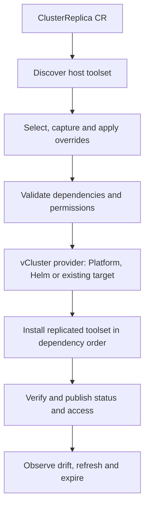

> **Design scope:** This document describes the complete intended product. The [current prototype](../../README.md) implements only a small runtime/lifecycle subset. Examples in this directory are proposals, not installable manifests.

# ClusterReplica: a vCluster wrapper

Product design, 19 September 2026. This specification describes the intended complete system: automatically recreate the host's replicable toolset, with selection and customization in one CRD. See the current README for the smaller implemented prototype.

The [phased implementation plan](cluster-replica-implementation-plan.md) defines engineering tasks, acceptance criteria and delivery estimates. The [vCluster compatibility policy](vcluster-compatibility-policy.md) defines version selection, release testing, upgrades and ongoing maintenance.

**Product contract**

An administrator installs the wrapper and grants its discovery/execution permissions. A developer applies a namespaced `ClusterReplica`. The wrapper discovers the host cluster's toolset, captures its configuration, applies the requested selection and overrides, creates or integrates with vCluster, installs the selected toolset inside the virtual cluster, and reports its readiness and differences. The scope includes authorized application Secret contents and cloud workload identity, including IRSA: the replica should preserve the selected applications' access to dependencies as well as their Kubernetes configuration.

Users do not need to assemble a Helmfile, write a platform template, prepare a blueprint, or install vCluster separately. The generated plan is an internal reproducibility artifact that users can inspect or export when useful.

**Kubernetes compatibility and capability adapters**

Build the core around host Kubernetes version, guest Kubernetes version, the selected vCluster runtime and available APIs. Start with two adjacent supported Kubernetes minors and matching host/guest versions. Use the same replication engine across distributions. EKS is the initial AWS integration test environment; generic provisioning and replication do not depend on AWS.

Automatically discover an internal ClusterCapabilities report: raw/normalized versions, API groups and schemas, relevant storage/network/admission behavior, identity mechanisms and selected operator requirements. Distribution identity is a diagnostic and adapter hint; actual capabilities determine compatibility. An unknown brand alone is not a reason to reject a compatible generic request. Permission-denied or unobservable required capabilities remain unresolved.

Matching Kubernetes versions does not reproduce vendor patches, control-plane flags, host nodes or every operator's semantics. The version matrix is supplemented by component and capability checks. Select IRSA, other cloud identities, storage backends and distribution-specific admission adjustments through adapters when a selected workload requires them. Report missing required support rather than dropping it. Upstream separately documents [host/guest Kubernetes compatibility](https://www.vcluster.com/docs/vcluster/manage/upgrade/supported_versions#kubernetes-compatibility-matrix) and [additional OpenShift requirements](https://www.vcluster.com/docs/vcluster/deploy/control-plane/kubernetes-pod/environment/openshift).

**Runtime integration**

| Situation | Proposed behavior |
| --- | --- |
| An authorized vCluster Platform connection is configured | Create a new replica through its management API and respect the configured project, template and namespace constraints. |
| The host has standalone vCluster Helm releases | Integrate with that provisioning model and create the replica's own Helm release in the requested namespace. |
| No vCluster setup exists | Install a pinned vCluster OSS chart/image as part of fulfilling the request. No Platform installation or account is required for this path. |
| The user explicitly references an existing virtual cluster | Populate that target after validating access and resource conflicts. Leave its lifecycle ownership with its existing manager. |

`provider: auto` selects between authorized integrations and the Helm fallback. Presence of another tenant cluster alone does not authorize modifying it. Every new replica normally gets its own virtual cluster. Explicit existing-target references use `vcluster.existingRef`; deletion or TTL expiry must not delete an externally owned target. If a configured Platform integration fails, report the failure rather than silently bypassing its policy through Helm.

vCluster supports both [Helm deployment](https://www.vcluster.com/docs/vcluster/deploy/control-plane/kubernetes-pod/basics) and a Platform [VirtualClusterInstance API](https://www.vcluster.com/docs/platform/api/resources/virtualclusterinstance). The wrapper delegates control-plane lifecycle to the selected mechanism. Selection is persisted for the lifetime of a replica; detecting a new manager does not migrate existing instances.

**The user-facing CRD**

The example in [cluster-replica.example.yaml](cluster-replica.example.yaml) is a proposed custom resource. It will become usable only when the operator and schema exist. The API group is illustrative.

- `metadata.namespace` is the destination host namespace. This avoids a second namespace field that could request deployment outside the caller's grant.
- `source.cluster: host` selects the main cluster hosting the wrapper. Remote source connections are a later extension.
- `vcluster.provider: auto` handles existing management integration or automatic Helm installation.
- `vcluster.versionPolicy: certified` resolves a new replica to an exact runtime version approved for its requested environment and capabilities. `vcluster.kubernetesVersionPolicy: match-host` requests the host Kubernetes minor and reports a compatibility failure if that combination is unavailable. The resolved runtime stays pinned through operator/catalog updates and source refresh; changing it requires an explicit upgrade or replacement.
- A host upgrade triggers compatibility reassessment, not automatic guest replacement. An explicitly different guest Kubernetes minor is a separate, certified compatibility-testing mode; shared host worker infrastructure limits what it can reproduce about a full cluster upgrade.
- `replication.preset: all-replicable` selects the supported, authorized toolset discovered on the host.
- `replication.secrets.mode: copy` includes selected, authorized application Secret contents. `updates: snapshot` captures them for the request; `follow` explicitly tracks later changes. Selections and exclusions also apply to Secrets. Identity tokens are regenerated through their issuer rather than treated as static application credentials.
- `identity.provider: auto` detects each selected workload's identity mechanism and selects an available, authorized adapter when needed. Optional AWS settings `identity.aws.irsa.roleStrategy: reuse-source` and `trustPolicy: reconcile` retain a source IAM role and request narrowly scoped binding changes allowed by the administrator's cloud grant. Detection alone does not grant AWS permissions. A request requiring an unavailable identity adapter stays unresolved; ordinary Kubernetes workloads have no AWS dependency.
- `replication.include` supports explicit component IDs, namespace filters, resource kinds and label selectors. Selections identify source objects, not destination objects.
- `replication.exclude` removes explicit components/resources and takes precedence over inclusion. If it removes a required dependency, plan validation reports the conflict instead of silently reintroducing it.
- Component IDs are stable source identifiers, such as `helm:cert-manager/cert-manager`, rather than guessed display names. Discovery exposes these identifiers.
- `overrides.helm` accepts per-release values; `overrides.resources` accepts typed resource patches. Namespace, domain, storage and credential mappings are also supported configuration surfaces. Overrides cannot enlarge the platform's grants or select forbidden host capabilities.
- `lifecycle.sourceUpdates: manual` captures source state at creation. Explicit refresh produces a new captured revision. Continuous following can be introduced as an opt-in mode after snapshot behavior is reliable.
- `lifecycle.targetDrift: report` allows developers and tests to modify cloned resources without having the wrapper continually undo their changes. Explicit CR changes or refresh can redeploy affected components. Enforced reconciliation is a separate opt-in mode.
- `lifecycle.ttl` sets a fixed lifetime from the ClusterReplica creation time, persisted as `status.expiresAt`; activity does not reset it. Expiry starts cleanup even if provisioning never reached Ready. `lifecycle.deletionPolicy: DeleteOwned` removes resources and data owned by the replica through the ownership inventory. This is separate from an optional future idle timeout.

The all-replicable preset reports discovered items that require a mapping, adapter or additional authorized access. It cannot silently present an inaccessible inventory as complete. Selected unresolved dependencies prevent readiness; deliberate exclusions appear in the final report.

**Reconciliation architecture**

1. **Discovery:** use API discovery and authorized reads to inventory Helm releases, recognized operators, CRDs, root custom resources, RBAC, configuration, webhooks and workload references. Prefer installation provenance over copying generated pods. Exclude the wrapper's own managed replicas from host inventory to prevent recursive replication. A vCluster installation is handled by the runtime adapter rather than copied as an application tool.
2. **Capture:** retain exact available chart/operator versions, image digests, desired configuration and provenance. Store the capture as a content-addressed plan, scoped to its authorized audience. Recover missing package provenance where possible; unresolved sources are explicit. API reads across resource types are not an atomic database snapshot.
3. **Plan:** calculate dependencies, apply explicit exclusions and typed overrides, map environment identities, regenerate destination-specific metadata and run permission/capability checks. Use deterministic adapters. General discovery can be extensible without pretending that every arbitrary CRD describes all its operator's semantics.
4. **Provision:** select and persist the provider, establish the host namespace baseline, create or connect to vCluster, and wait for its API. Use two separate clients and identities for host and guest operations. Keep virtual CRDs/RBAC inside the guest API.
5. **Install:** recreate independent selected operator instances inside vCluster. Resolve CRDs, operator services and certificates, webhooks, custom resources and dependent applications in the correct order. Operator adapters handle bootstrap cycles. Avoid installing both a controller's generated resources and their owning custom resources as independent desired state.
6. **Verify:** check source-version/configuration correspondence and adapter-specific behavior. For example, issue a certificate with a test issuer or confirm a policy rejects its negative example. Record configured differences and shared host capabilities separately.
7. **Lifecycle:** retry partial work idempotently, report target drift, process explicit refresh, revoke access at expiry, and remove only owned resources. Retained storage or external resources remain visible in status. Existing-target mode leaves the referenced virtual cluster intact.

Use a Go operator with controller-runtime, dynamic Kubernetes clients, a Helm provider and a Platform provider. Keep discovery, planning, runtime provisioning and component adapters behind independent interfaces. A generated plan can later be exported to other deployment tools without becoming a required step in the user flow.

**Access for people, CI and agents**

Expose a standard Kubernetes API and kubeconfig for each replica. Provisioning access to the wrapper and access to workloads inside a replica are separate permissions. Ordinary tools such as kubectl, Helm and Kubernetes SDKs work against the replica endpoint. Add a proposed `replica connect <name> -n <host-namespace>` command that resolves the selected provider, checks the authenticated principal's grant, establishes a reachable connection and creates an explicitly named kubeconfig context. A scoped `replica run ... -- <command>` form keeps an agent or CI process bound to that replica without changing the caller's normal context. These commands are design proposals, not installed executables.

vCluster already provides [connect and expiring service-account credential options](https://www.vcluster.com/docs/vcluster/cli/vcluster_connect) and [kubeconfig export](https://www.vcluster.com/docs/vcluster/configure/vcluster-yaml/export-kube-config). The wrapper should reuse these capabilities where appropriate while selecting explicit grants and expiration. Default exported administrator credentials remain bootstrap credentials for the controller; they are not the default credential delivered to every user or agent.

| Consumer | Authentication and connection |
| --- | --- |
| Human with authorized host access | Existing host authentication plus a permitted local port-forward and a separate identity in the replica. The CLI manages the tunnel lifetime. |
| Human using vCluster Platform | Existing Platform login, project access and proxy connection. Map the replica to its managed instance rather than creating another user directory. |
| Human without host access on a standalone installation | An optional access service authenticates organizational OIDC/SSO and serves a private or otherwise explicitly exposed replica API route. |
| CI or agent outside the replica | A dedicated machine identity authenticates to the access service or Platform, obtaining replica-scoped, short-lived credentials through a reachable HTTPS endpoint. Support CI OIDC or a configured machine identity without requiring interactive login. |
| Agent running inside the replica | Its own guest ServiceAccount and in-cluster Kubernetes authentication with appropriate guest RBAC and credential rotation. An agent on the host instead needs an explicit guest kubeconfig; host in-cluster configuration targets the wrong API. |

For the first standalone milestone, support authorized host users with port forwarding and a CI runner on the private network. A later access service can provide OIDC login and routing for consumers without host credentials. Prefer a shared gateway over a separate public load balancer for every replica. A valid kubeconfig does not make an internal ClusterIP address reachable from an external agent; VPN, private runners, an approved tunnel or a reachable gateway must supply that path. Validate TLS and support Kubernetes streaming operations such as watches, logs, exec and port-forward. Application endpoints such as Trino and Spark UI are exposed separately, through permitted service port-forwarding or explicit routes with their own authentication as needed.

The access provider checks authenticated identity, immutable replica UID, expiry and an administrator-controlled grant. A caller cannot self-authorize by editing an owner field or requesting an arbitrary role. Offer viewer, workload-deployer and replica-administrator profiles, with custom roles when needed. Workload deployment permissions can indirectly expose namespace credentials by mounting Secrets, so profile names alone are not a secret-isolation boundary. Creation/deletion permissions for ClusterReplica resources do not automatically imply guest administrator access or access to source-cluster credentials.

Use per-principal or per-run identities for attribution. For external clients, prefer a kubeconfig exec credential plugin backed by the approved identity provider/access service; Kubernetes supports [expiring ExecCredential responses](https://kubernetes.io/docs/reference/access-authn-authz/authentication/#client-go-credential-plugins). Consumers without exec-plugin support can use a protected, rotating credential file. Bound issued sessions by both the allowed session duration and the replica's remaining lifetime, and verify the actual expiration returned by the issuer. Kubernetes service-account credentials can use [TokenRequest and projected tokens](https://kubernetes.io/docs/concepts/security/service-accounts/). Existing Platform deployments can use its documented [access keys and OIDC exchange](https://www.vcluster.com/docs/platform/administer/authentication/access-keys), subject to configured grants.

At expiry, deny new sessions and renewals, revoke owned guest access bindings/identities, close owned access routes and streams, and begin resource cleanup. Removing a downloaded kubeconfig file or its source Secret alone does not revoke credentials already issued. A strict access cutoff requires an enforced gateway path that cannot be bypassed and that closes existing sessions; direct connections depend on actual token expiry and endpoint shutdown, and must not be described as instant revocation if a controller is unavailable. Previously described AWS session lifetimes remain a separate concern.

Agents use the same permission model as other clients. Any agent with shell or Kubernetes API capability can consume this interface. An optional MCP facade may expose replica create, status, apply, logs and delete operations, always using the authenticated agent's grant and the same underlying controller. Keep connection credentials in the tool runtime or mounted credential files rather than embedding them in prompts or returned status. MCP is an additional interface, not a requirement to use the product.

Add acceptance checks for laptop access, an external private CI runner, and an agent inside the replica; allow/deny behavior for each role; token renewal; replica name reuse; watch/exec/port-forward; TLS verification; and expiry while a connection is open. No access integration has been executed yet.

**Adapter contract**

Each component adapter supplies detection, capture, dependency resolution, configuration transformation, installation, health/behavior checks and cleanup rules. Start with Helm-installed tools and a small tested operator catalog. Add OLM and more specialized operators through adapters.

The default operator mode is a recreated instance. Sharing a host operator is an explicit mode because it has different isolation and upgrade-testing behavior. Likewise, test credentials/data and host-provided storage/networking are recorded choices. Node-level components that cannot be independently reproduced on shared workers appear in the capability report.

**Secrets and cloud identity**

Secret copying is a supported part of replication, including production application credentials when the source-to-destination grant permits their use. The grant identifies which callers, source objects, target namespaces and cloud roles are allowed; possession of a namespaced ClusterReplica creation permission alone does not authorize reading every host Secret or assuming every host role. Administrators establish this policy once, after which eligible requests execute automatically.

Copy the selected Secret's data, type and meaningful configuration, and rewrite destination-specific references and ownership. Offer snapshot, continuous-follow and mapped replacement behavior. Protect payloads in transit and at rest; keep values out of logs, status, ordinary plan exports and public digests. Secret-bearing Helm values and ConfigMaps receive the same handling. A controller-managed Secret needs one ownership strategy: recreate its managing controller and backend binding, or capture a standalone snapshot with that manager disabled for the target object. Recreating an ExternalSecret also requires a working backend identity and provider configuration.

Service-account and bootstrap tokens are identity artifacts. Mint target tokens through their issuer and preserve rotation; copying a source token would continue to identify its source principal, not create a replica identity. Kubernetes documents [projected tokens and TokenRequest](https://kubernetes.io/docs/concepts/security/service-accounts/). Certificates can be copied where their intended names remain valid or reissued when destination names change. Cluster API signing keys and live object metadata are not application configuration.

For IRSA on shared EKS nodes, use vCluster's documented [ServiceAccount synchronization](https://www.vcluster.com/docs/vcluster/configure/vcluster-yaml/sync/to-host/advanced/service-accounts). This allows the host OIDC provider to remain the issuer used for cloud access. The wrapper must:

1. Discover the selected workload's service account, role annotation, projected-token requirements and related IAM trust policy through authorized access.
2. Recreate the service account in the virtual API and resolve the actual synchronized service-account name and namespace on the host. Do not guess a translated name or bind all workloads to the wrapper/control-plane role.
3. Reuse the selected source IAM role or apply an explicit role mapping. Add a replica-specific trust statement only if necessary and permitted. AWS validates the OIDC provider, token audience and service-account subject; retaining the annotation alone is insufficient. See [AWS's role association procedure](https://docs.aws.amazon.com/eks/latest/userguide/associate-service-account-role.html).
4. Ensure the workload receives the correct rotating cloud-identity token and SDK configuration while retaining its own virtual Kubernetes API identity.
5. Verify the expected assumed role and a configured representative dependency operation. Report what was actually verified; successful STS authentication alone does not establish all S3, Glue, KMS or database permissions.
6. Track ownership of added statements and bindings, preserve existing source access, and remove only owned additions at expiry. Serialize conflicting updates and surface out-of-band conflicts. Already issued cloud sessions can remain valid until expiry, so cleanup does not promise immediate revocation of every token.

The resulting host identity is different even if the guest namespace and service-account names match the source. Cloud policies that depend on identity names or session attributes must be evaluated by the adapter. Reusing a role preserves its permission policies and access to existing cloud resources; it does not create a separate S3 bucket or database. Equivalent-looking policy documents alone cannot guarantee identical effective access.

Kubernetes RBAC and cloud IAM are separate grants. Where a required binding already exists, use it. Where changes are needed, the wrapper needs authorized IAM/EKS access or an integration with the organization's IaC controller. Otherwise it records the exact missing binding and leaves the dependent component unready; it does not silently broaden a role's trust policy.

EKS Pod Identity is a separate adapter that recreates associations for the actual host cluster, namespace and service account. AKS Workload Identity and GKE Workload Identity need their own federation/binding adapters. vCluster publishes [EKS Pod Identity](https://www.vcluster.com/docs/vcluster/third-party-integrations/pod-identity/eks-pod-identity), [AKS](https://www.vcluster.com/docs/vcluster/third-party-integrations/pod-identity/aks-workload-identity) and [GKE](https://www.vcluster.com/docs/vcluster/third-party-integrations/pod-identity/gke-workload-identity) integration guides. Their documented flows can involve Platform APIs; validate capabilities in the pinned OSS build before claiming a Platform-free implementation for every adapter. This proposal has not yet exercised those integrations.

**Ephemeral data and TTL cleanup**

TTL initiates a teardown workflow. Completion depends on Kubernetes controllers, cloud APIs and storage backends; expiry is not a guarantee that every byte disappears at that instant. Keep cleanup state across operator restarts, retry failures, and report unfinished cleanup until verified.

The inventory must distinguish replica-owned resources from shared source dependencies. Track resources created during tests as well as during installation, including guest and host objects, PVCs and backing disks, snapshots, registered object-store prefixes or buckets, database instances or schemas, load balancers, DNS entries and identity bindings. Resource adapters determine which of these are present and how to delete them. Preserve the controllers needed to finalize their managed resources until that cleanup completes. Never delete the source cluster's shared resources or an externally owned target vCluster.

PersistentVolume reclaim policy matters: [Kubernetes documents](https://kubernetes.io/docs/concepts/storage/persistent-volumes/) that `Retain` leaves storage/data behind. Fully ephemeral storage needs a supported deletion path, verified backing-resource ownership and permission to remove it. Backups, object versions or retention locks must be accounted for by the relevant adapter. Report a blocked deletion rather than claiming complete cleanup or stripping finalizers to hide leftovers.

Offer two explicit data behaviors. Reusing source data preserves the existing endpoints and authorized credentials but leaves those shared resources outside replica cleanup. An isolated-data mode creates empty, seeded or independently restored stores, maps endpoints and credentials, and restricts writes to the replica's owned destinations. Arbitrary writes to an existing shared database or bucket cannot be reliably undone at TTL. An isolated-data claim therefore requires all selected write paths to have a supported mapping; unknown writable external dependencies block that claim.

Expose `Expired`, `Deleting`, `CleanupBlocked` and `CleanupComplete` lifecycle conditions, with remaining resource identifiers and reasons. Final cleanup evidence contains metadata only, not copied credentials or data. A resource retention policy must appear as an explicit exception to the deletion contract.

**Status is part of the product**

Track conditions such as `Discovered`, `PlanResolved`, `RuntimeReady`, `ToolsetReady` and `Verified`, with observed generation and capture digest. Expose per-component source identity/version, chosen action, destination, readiness, deviations and errors. A permission-denied result is `Unknown`, rather than “not installed.” Readiness requires all selected required components; a known incompatible component gets a clear explanation.

Access information should point to an authorized credential-delivery mechanism, not expose an admin kubeconfig in a broadly readable status field. In existing-target mode, object name/field conflicts fail visibly by default rather than overwriting unrelated content.

**First milestone**

Demonstrate the complete flow with a host containing a Helm-installed policy operator, cert-manager and an example application: apply one ClusterReplica, auto-provision vCluster, reproduce the selected versions/configuration with test identity mappings, and apply an override. Exercise both a host without vCluster and an existing-management integration. Confirm that explicit exclusions, missing permissions and unresolved dependencies produce accurate status.

Add a portable data-workload scenario with Spark Operator, a Spark job and Trino using a lab data store across the supported Kubernetes pairs. Copy selected application Secrets, run a job against a designated dataset and query the result. Separately qualify EKS IRSA with source-role preservation or mapping, rotation/refresh, node placement, resource budgets and owned cloud-binding cleanup. The core and cloud profiles have independent acceptance gates. These are planned acceptance checks, not completed cluster tests.

The wrapper's distinguishing behavior is deriving an installable replica from the running host. Existing [vCluster Stacks](https://www.vcluster.com/docs/platform/understand/what-are-stacks) already handle declared dependencies and application delivery; use their capabilities where appropriate. This design is a concrete prototype target, not evidence of market demand or verified cross-distribution compatibility.

**Product differentiation assessment**

Research checked again on 19 September 2026. Easy provisioning and lifecycle automation have substantial prior art. vCluster Platform supplies [UI/CLI/API provisioning](https://www.vcluster.com/docs/platform), [templates with preinstalled Apps and objects](https://www.vcluster.com/docs/platform/administer/templates/create-templates), and [inactivity-based auto-delete](https://www.vcluster.com/docs/platform/use-platform/virtual-clusters/key-features/sleep-mode). The latter is not the same clock as the proposed fixed lifetime. [Uffizzi Cluster Operator](https://github.com/UffizziCloud/uffizzi-cluster-operator) already supplies CRD-based virtual-cluster provisioning with Helm charts and manifests. [vCluster snapshot restoration](https://www.vcluster.com/docs/vcluster/manage/backup-restore/restore) can reproduce an existing virtual cluster's state.

The potential distinction is deriving a runnable environment from a live ordinary host: discover its selected installed tools, capture versions and configuration, reconstruct dependencies and cloud identities, verify behavior, and manage owned data through expiry without requiring the user to author an installation template. The reviewed projects and documentation did not establish a maintained open-source tool delivering that complete workflow. This is a bounded research finding, not proof of global uniqueness.

Build a focused prototype to validate the workflow. Start with Kubernetes version/API compatibility, generic Helm capture, Spark Operator and Trino adapters, and owned-storage cleanup. Qualify AWS identity through EKS as the first cloud extension. Compare setup effort, time to workload readiness, required manual corrections and leftover resources against vCluster plus templates/Helm/GitOps. Validate on independently configured host clusters, not only a demo prepared specifically for the wrapper. Strong differentiation would come from reliable adapters and useful verification; an easier provisioning interface and TTL alone provide limited distinction. No deployment speed, broad compatibility or adoption claim has been measured yet.
