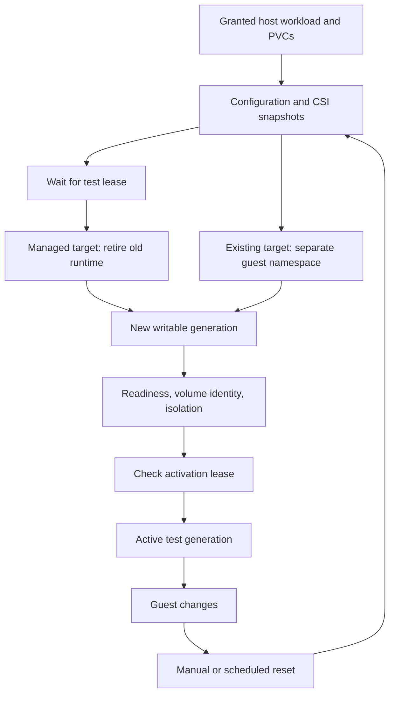

# Workload mirrors and scheduled data resets

> **Versioned instructions:** these commands use v0.3.0-alpha.2. Use matching CLI, chart, image and CRDs from that release. Check the release and validation record for source and published-artifact evidence; use a source build when testing an unreleased revision.

A `ReplicaMirror` creates an independent writable copy of selected workloads and their granted PVC data. Tests can change the copy. A manual or scheduled sync captures current source state and replaces the test generation. A reset to a retained revision reproduces that revision's configuration and volume recovery points. Access to a new generation starts only after readiness checks pass.

This module was introduced in v0.2.0-alpha.1; v0.2.0-alpha.2 corrected infrastructure exclusions and qualified late enablement. The examples below target **v0.3.0-alpha.2**. Use the operator, CLI, CRDs and chart from the same release. The original v0.1.0-alpha.1 does not include it. Live compatibility evidence and remaining limits are recorded on the [validation page](../validation.md).

## Behavior



Source configuration and data are never overwritten by guest tests. A CSI capture still consumes storage/I/O and snapshot-controller activity; zero operational impact is not promised. The schedule triggers work. Capture, provisioning, and readiness take time, so activation happens later than the scheduled instant.

The adapter supports **per-volume crash consistency**. It does not claim one atomic recovery point across multiple PVCs, application-consistent database backups, process-memory checkpoints, or replication of external databases, queues, and buckets. Unsupported application consistency cannot silently fall back. Cloud storage providers need separate qualification; matching Kubernetes versions is insufficient.

## Install the optional module

**Already installed Replicove?** Follow [enable mirroring later](enable-mirroring.md), which updates CRDs and preserves the existing release's settings and key. The installation example below is for a new release; its full values file can replace existing source-rule arrays if reused carelessly during an upgrade.

The same Helm chart and operator image include the mirror controller. No VolSync or Velero deployment is required for this CSI adapter. Set `mirrors.enabled: true` and delegate source snapshot permissions with `mirrors.sources`. The chart's snapshot-controller mode is:

| Mode | Behavior |
| --- | --- |
| `auto` | Install bundled snapshot APIs/controller when snapshot APIs are absent; reuse an existing installation otherwise. Preserve the bundled Deployment across upgrades; reinstall it when retained APIs belong to this same Helm release. |
| `existing` | Reuse host snapshot infrastructure without installing a controller. |
| `managed` | Explicitly install the bundled controller; use only when the administrator has established that it will not duplicate another controller. |

The bundled controller is Kubernetes CSI external-snapshotter **v8.6.0**. Existing CRDs are not adopted or replaced. An incomplete existing snapshot installation must be repaired by its administrator. CSI drivers, encryption permissions, and the host CNI remain host infrastructure: Replicove does not replace cloud drivers or networking during installation.

Before enabling data mirrors, establish:

- A CSI driver that can snapshot and restore the source filesystem PVC into the chosen destination StorageClass.
- A `VolumeSnapshotClass` with `deletionPolicy: Delete` and a destination StorageClass with `reclaimPolicy: Delete`, both using the source CSI driver.
- Host NetworkPolicy enforcement and admission restrictions suitable for the users who can run code in the guest. Set `mirrors.networkPolicyEnforced: true` only after verifying that enforcement.
- Enough capacity for the active and candidate generations plus retained captures.

Download the [installation values](../../examples/mirror/values.yaml) and edit the source namespace. The same version is available in the release repository:

```bash
curl -fsSLo mirror-values.yaml \
  https://raw.githubusercontent.com/nimeshbuilds/replicove/v0.3.0-alpha.2/examples/mirror/values.yaml
# Edit mirror-values.yaml for the granted source and qualified host CNI.
helm upgrade --install replicove oci://ghcr.io/nimeshbuilds/charts/replicove \
  --version 0.3.0-alpha.2 \
  --namespace replicove-system --create-namespace \
  --values mirror-values.yaml --wait --timeout 5m
```

The CLI installer accepts the same values file. YAML installations can use `helm template ... --include-crds` to render the chart, or supply equivalent module flags and RBAC. Helm template cannot discover a live cluster; set snapshot-controller mode explicitly when rendering for GitOps. The default native YAML installer leaves the optional module disabled.

Upgrade the Replicove CRDs from the same revision before upgrading an existing installation; Helm does not automatically upgrade files in its `crds/` directory. See [installation upgrades](../getting-started/installation.md#upgrades-and-removal).

## Grant access to data

The administrator's `ReplicaGrant.spec.mirror.volumes` lists exact PVC names and approved snapshot/destination classes. Generic resource-read permissions and `allowEmptyVolumes` alone do not authorize source data capture.

```yaml
# Within ReplicaGrant.spec; the complete example also delegates namespace/kinds.
allowEmptyVolumes: true
mirror:
  minInterval: 1h
  maxRevisions: 2
  allowForcedReset: false
  volumes:
    - namespace: source-dev
      name: orders-data
      snapshotClass: csi-hostpath-snapclass
      storageClass: mirror-csi
```

The example class names describe the disposable CSI fixture, not a cloud default. Replace them with your administrator-approved classes. `allowEmptyVolumes` permits provisioning destination PVCs; the mirror controller fills each selected PVC from its approved snapshot and refuses an empty-volume fallback.

The operator's normal `sources` rules authorize selected workload/configuration reads. `mirrors.sources` adds only PVC reads and snapshot creation/inspection/deletion in those namespaces. Snapshot-content import requires additional cluster-scoped snapshot permissions, enabled only with the mirror module. Users never provide backend volume or snapshot handles.

## Create a mirror through YAML or the CLI

Edit and apply the complete [grant](../../examples/mirror/grant.yaml) and [mirror](../../examples/mirror/mirror.yaml). The example assumes an existing `orders` Deployment in `source-dev` using `orders-data` and selects its dependencies:

```bash
curl -fsSLo mirror-grant.yaml \
  https://raw.githubusercontent.com/nimeshbuilds/replicove/v0.3.0-alpha.2/examples/mirror/grant.yaml
curl -fsSLo mirror.yaml \
  https://raw.githubusercontent.com/nimeshbuilds/replicove/v0.3.0-alpha.2/examples/mirror/mirror.yaml
# Edit names, selectors, approved classes and grants for your source workload.
kubectl apply -f mirror-grant.yaml
kubectl apply -f mirror.yaml
kubectl -n replica-lab wait replicamirror/orders \
  --for=condition=Ready --timeout=10m
```

Alternatively, create the same request with:

```bash
replicove mirror create orders --file mirror.yaml
replicove mirror status orders
replicove mirror connect orders --role deployer --output ./orders.kubeconfig
```

`connect` resolves the active generation once and obtains an expiring guest session. It never redirects an ongoing test into a replacement generation. Reconnect after a reset. Kubernetes TokenRequest requires at least ten minutes of remaining lifetime when issuing a session; allow at least 15 minutes including provisioning for CLI/agent access. Shorter mirrors can run through an existing administrator-controlled integration route. Existing targets use their configured network route through `mirror access`.

The template and selected PVC list are immutable. Interval, suspend, retention within the grant, and the bounded test lease can change. Template TTL bounds the **whole mirror**, including capture and every replacement; resetting does not renew it. All captured PVCs must be listed. StatefulSets require every current ordinal's PVC, including controller-owned claims, to be explicitly granted. CronJobs are suspended in copies. One-shot Jobs require a future replay adapter.

Managed mirrors provision a dedicated vCluster for each generation and preserve selected guest namespace names. **vCluster 0.37.1 permits one runtime per host namespace.** A managed reset captures and validates its recovery points first, waits for the test lease, cleans the previous owned runtime, then provisions its replacement. This causes an interruption while the new runtime and volumes become ready. Use another administrator-granted destination for a separate concurrent managed cluster, or register an existing target. Replicove does not delete unrelated runtimes to make room.

Existing-target mirrors create new, exclusively owned guest namespaces inside the registered runtime, so they can prepare a replacement before retiring the old generation. They currently require namespaced resources and an administrator-qualified `existingTargets[].mirrorReleaseName` for a vCluster 0.37.1 single-namespace runtime in the destination host namespace, using its default separate CoreDNS deployment (`k8s-app: vcluster-kube-dns`, backend port 1053). Custom/embedded DNS and alternative label translation require separate qualification. Shared operators/schemas must already be available, or use a dedicated runtime. Namespace names and references can change; arbitrary configuration strings and external endpoints are never guessed.

## Sync latest data, or reset to a saved capture

```bash
# --run-name makes client retries idempotent.
replicove mirror sync orders --run-name orders-build-127
replicove mirror revisions orders

# Select a retained Sync run from the preceding output.
replicove mirror reset orders --revision SAVED_SYNC_RUN --run-name reproduce-127
```

The YAML equivalent is an immutable `ReplicaMirrorRun`:

```yaml
apiVersion: replica.nimeshbuilds.dev/v1alpha1
kind: ReplicaMirrorRun
metadata:
  name: orders-build-127
  namespace: replica-lab
spec:
  mirrorRef:
    name: orders
    uid: REPLACE_WITH_CURRENT_MIRROR_UID
  action: Sync
```

For `action: Reset`, include `revisionRef: {name: SAVED_SYNC_RUN, uid: SAVED_RUN_UID}`. Read the actual UIDs from Kubernetes. Name reuse cannot authorize a different mirror or capture. Resetting requires current, unchanged source authorization even though it does not recapture the source.

Captured Secret values and backend handles remain in encrypted protected state. Status exposes recovery timestamps, revision IDs, child replica identities, and sanitized progress. Pin workload images by digest if reproducible binaries are required: a saved mutable image tag does not freeze a registry image or external service.

## Scheduling and test leases

```bash
kubectl -n replica-lab patch replicamirror orders --type=merge \
  -p '{"spec":{"interval":"4h"}}'

replicove mirror hold orders --duration 20m
# Run the integration test against the currently active generation.
replicove mirror release orders
replicove mirror suspend orders
replicove mirror resume orders
```

Only one candidate modifies a mirror at a time; missed intervals coalesce. Acquire the lease before submitting a reset. Managed runs report `AwaitingReplacement` while a lease preserves the current runtime; after release they enter `Replacing` and retire it before provisioning. Existing-target candidates can become ready in separate namespaces and report `AwaitingActivation` until the lease is released. Each lease extension is at most 30 minutes. This is shared namespace delegation, not per-agent lease ownership. Suspension stops new automatic scheduling; already queued manual or automatic work continues. Use `mirror cancel RUN` to cancel a candidate. An active run or a capture needed by an active or retiring generation remains protected until it is no longer used or the mirror itself is deleted.

`--force` bypasses a lease only when `allowForcedReset` is enabled in the administrator grant. A reset discards guest changes within the mirror's owned scope. It is intentionally disruptive to tests using that generation.

## Failures and isolation

Capture failures preserve the active generation and report `Blocked` with a reason. Existing-target restore failures also preserve its previous generation. For a managed target, once `Replacing` starts the old runtime is retired; a later provisioning/restore failure leaves no active session until recovery succeeds. Retained captures remain available for retry or an explicit reset, but there is no automatic rollback. Cancelling after replacement starts does not recreate the old runtime. Transient dependency failures are retried. A source identity/configuration change during capture requires cancelling that run and starting a new sync. Grant UID/version changes block new work instead of widening authorization in place. Delete and recreate the mirror after reviewing a changed grant.

The host policy permits traffic among the generation's workload namespaces, its guest DNS, and its virtual API. Other egress is denied by the qualified host CNI. This adapter does not expose arbitrary egress exceptions. Provide test-side dependencies in the copied scope. Kubernetes policies are additive: host administrators must ensure another policy does not permit production egress for the same Pods. Shared-node vClusters are not independent kernels or protection against hostile privileged workloads.

For existing runtimes, issued mirror access uses namespaced RoleBindings limited to that generation's namespaces; even the requested `admin` role stays namespaced. Retired access is revoked. Ordinary non-mirror access retains its documented grant-level behavior.

## Retention, deletion, and TTL

`retainRevisions` keeps bounded source captures, not spare running vClusters. Active revisions and revisions referenced by queued/in-progress resets are protected during replacement, so a transition can temporarily exceed the retained history count. Old runtimes are cleaned before another candidate starts. Delete the mirror with:

```bash
replicove mirror delete orders
kubectl -n replica-lab wait replicamirror/orders --for=delete --timeout=7m
```

Cleanup revokes access, removes owned workload generations, verifies supported destination volumes, removes imported snapshot references, and deletes the mirror's original captures. Imported references use `Retain` so they cannot delete the underlying source capture while it is still retained. Source PVCs and their backend data are never deleted. Finalizers remain when cleanup or ownership cannot be verified. Backend object deletion is not proof of erasure from provider backups.

Keep the operator, protected encryption key, CSI driver, and snapshot controllers available until every mirror is deleted or expired and cleaned. Do not disable the module while it owns resources. Snapshot CRDs are retained on chart removal; inspect any other host consumers before removing snapshot infrastructure.

## Developer verification

`go test -race ./internal/mirror` exercises policy, source/snapshot identity, saved-plan independence, import retention, and cleanup boundaries. The API-server suite installs generated schemas and the chart. `hack/e2e-mirror.sh` creates its own disposable kind host with pinned Calico and CSI host-path fixtures, installs the actual chart/operator/vCluster, and checks copied data and resets. It never installs test CSI/CNI infrastructure into an existing host.

The current fixture is intentionally small. It cannot certify EBS, Azure Disk, GCE Persistent Disk, Ceph, NFS, multi-volume transaction consistency, or TB-scale restore performance. Add driver/application qualification before expanding those claims.
